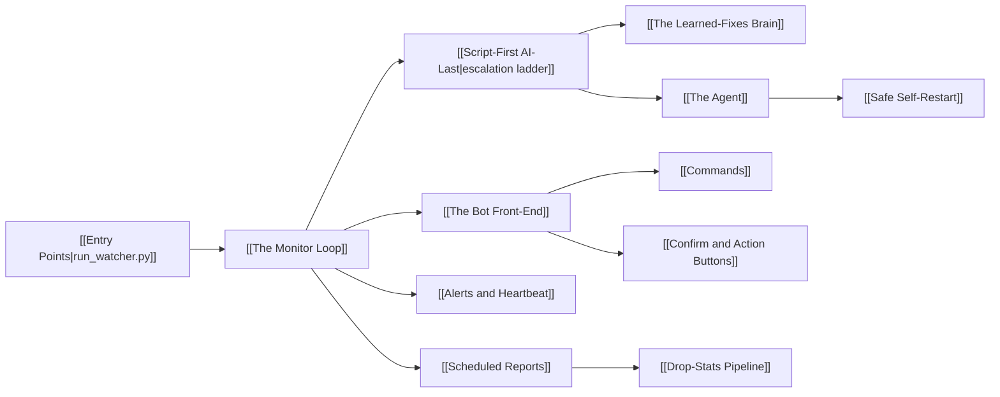

# 🐶 WatcherDog — Knowledge Base

> The map of content for the WatcherDog vault: a monitor for a fleet of Telegram CS2/Steam drop-farming bots that auto-fixes known errors at zero AI cost and escalates only genuinely novel ones.

This is the front door. Every note links back here, and the [[#🗺️ The graph|graph view]] will show the whole web. New here? Read [[Architecture Overview]] first, then follow the links.

## ⚡ What it is, in one breath

WatcherDog runs **one asyncio process with [[Two Identities One Process|two Telegram logins]]** — a **user account** that can read the farm bots and drive their panels, and a talking **bot** for humans. Every farm message climbs a [[Script-First AI-Last|cheap-to-expensive ladder]]: a free classifier, a local Ollama triage, a deterministic [[The Learned-Fixes Brain|learned-fixes]] router, and only then [[The Agent|an OpenRouter model]] — once — after which the fix is remembered and every repeat is free.

## 🚦 Current state (snapshot · 2026-06-06)

> [!info] This is a **fresh checkout that has never been run.**
> - There is **no `data/` directory** yet — every runtime path in [[Data and State]] is created on first run.
> - A `.env` exists (you created it) but is **secret and never read** by this vault. See [[Configuration]] for the ~94 keys.
> - The codebase is the **script-first MTProto watcher** (`run_watcher.py`). The GUI/OCR and log-tailer paths are [[Legacy Modes|legacy]].

> [!warning] Verified doc-vs-code drift (corrected throughout this vault)
> The hand-written [[README]] / [[DOCUMENTATION]] carry a few stale claims that the deep-dive caught:
> - **Test count:** large and growing — run `pytest` for the live number; the 4 known failures are pre-existing (legacy GUI imports + concurrency timing) → see [[Testing]].
> - **"Router runs before any LLM":** the **local Ollama triage runs *first***; the router is "first" only relative to the *OpenRouter* agent → see [[Script-First AI-Last]].
> - **A 5th router status, `needs_confirm`,** exists beyond the four documented → see [[Script-First AI-Last]] and [[Confirm and Action Buttons]].
> - **Unpinned deps:** `gspread`/`google-auth` ([[Drop-Stats Pipeline]]) and `pyobjc` ([[Legacy Modes]]) are **not in `requirements.txt`** (only `telethon`) → see [[Configuration]].
> - **`heartbeat.py` is legacy:** the live watcher does silence detection **inline**, not via `HeartbeatMonitor` → see [[Alerts and Heartbeat]].

## 🧭 Start here

- [[Architecture Overview]] — the whole system on one page.
- [[Running WatcherDog]] — install, authorize, run, watch, stop.
- [[Module Reference]] — every module in one table, linked.
- [[Glossary]] — terms (ibo, panel, farm, SinFermera, Hermes…).

## 🏛️ Architecture

- [[Two Identities One Process]] — why a user account *and* a bot.
- [[Script-First AI-Last]] — the cheap-to-expensive escalation ladder.
- [[The Monitor Loop]] — `mcp_watcher.run()`, the sweep, the listeners, the schedule.
- [[Safe Self-Restart]] — pre-flight import check + detached rollback supervisor.
- [[Entry Points]] — the supported launcher vs. the retired ones.

## 🧩 Components

- [[The Agent]] · [[Telegram Tools and Actions]] — the tool-calling loop and what it can read/drive.
- [[The Learned-Fixes Brain]] — the human-readable Markdown memory.
- [[The Bot Front-End]] · [[Commands]] · [[Confirm and Action Buttons]] — the human-facing surface.
- [[Alerts and Heartbeat]] · [[Roster and Health Scan]] — detection and the shared no-LLM scan.
- [[Scheduled Reports]] · [[Drop-Stats Pipeline]] — the hourly/weekly/daily jobs and the Sheets push.
- [[Monitoring and Recovery Rules]] · [[Panel Control Bot]] — the deterministic per-panel watch/recover rules and the SinFermera bot's status + button vocabulary they act on.

## 📚 Reference & Operations

- [[Configuration]] — every `.env` key, grouped (incl. the `ALLOWLIST` multi-user allow-list).
- [[Data and State]] — the runtime files under `data/`.
- [[Running WatcherDog]] · [[Troubleshooting]] · [[Testing]] · [[Legacy Modes]].
- **Login & diagnostic tools** — `tools/tg_login.py` (now a transparent one-shot authorizer) and `tools/tg_probe.py` (a non-interactive MTProto handshake/auth health probe that distinguishes a network/Python fault from a just-need-to-log-in state). Full usage lives in [[Running WatcherDog]] and [[Troubleshooting]].

## 🛠️ The agent's own guides (Hermes)

- [[Hermes Skills]] — the operating guides that build the agent's system prompt: [[STRUCTURE]], [[SKILLS]], [[TOOLS]] and skills [[00-panels]] → [[07-self-improve]].

## 📎 Pre-existing top-level docs

- [[README]] — what it is + quick start. · [[DOCUMENTATION]] — developer internals. · [[HOWTORUN]] — the runbook. · [[OPTIMIZATION_PLAN]] — why it became script-first. · [[WISHLIST]] — parked ideas.

## 🗺️ The graph

Open **`Architecture Map.canvas`** (in this folder) for a hand-wired visual map, or hit the graph icon — every note in this vault is tagged `#watcherdog` and cross-linked, so the graph clusters cleanly into architecture / components / reference / operations.

## 🏷️ Tag index

`#watcherdog` · `#architecture` · `#component` · `#reference` · `#operations` · `#concept` · `#telegram` · `#ai` · `#config` · `#data` · `#testing` · `#legacy` · `#security`
