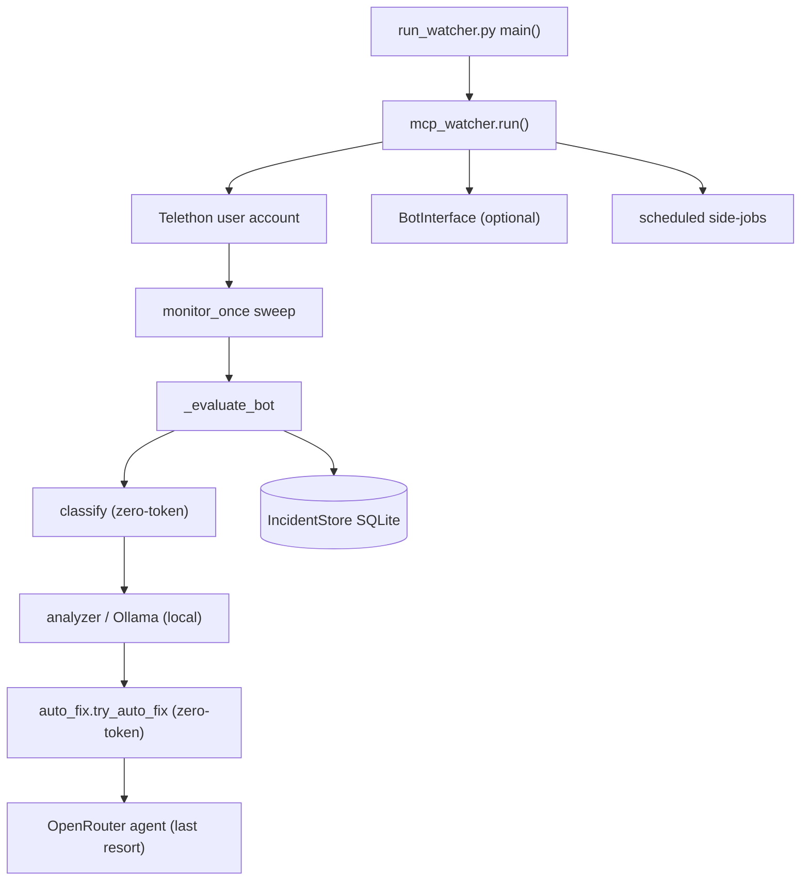

# Architecture Overview

> WatcherDog is one asyncio process that logs into Telegram as the owner's user account, sweeps a watch folder of farm bots, and escalates work through a cheap-to-expensive ladder — script first, AI last.

Part of [[Home]].

WatcherDog is a single Python process built around [[The Monitor Loop|one asyncio event loop]]. The supported launcher is `run_watcher.py`, which boots config/logging/prompts and hands off to `mcp_watcher.run()`. Everything else — proactive sweeps, the talking bot, scheduled reports, the drop-stats job, self-restart — lives inside that one loop. See [[Entry Points]] for the supported launcher versus the retired ones.

## The big picture

WatcherDog wears [[Two Identities One Process|two Telegram identities in one process]]: an MTProto **user account** (Telethon) that can read the SinFermera farm bots' messages, and an optional **bot account** ([[The Bot Front-End]]) that talks to humans and is the preferred alert channel. The Bot API forbids a bot from reading another bot, so every read and every panel action the bot performs is delegated to the user-account client.

## The escalation ladder

The defining philosophy is [[Script-First AI-Last]]: every farm-bot message runs through cheap deterministic stages, and an expensive model is only spent when nothing local can handle it.

| Tier | Stage | Cost | Module |
|------|-------|------|--------|
| 0 | `classify(text)` prefilter | zero token, no model | `watcherdog/classifier.py` |
| 1 | `analyze_message` triage | local model, no API tokens | `watcherdog/analyzer.py` (Ollama) |
| 2 | `try_auto_fix` deterministic router | zero token, no model | `watcherdog/auto_fix.py` |
| 3 | OpenRouter agent (`agent.answer`) | real API tokens | `watcherdog/agent.py` ([[The Agent]]) |

> [!warning] Two AI tiers are easy to conflate. `analyzer.py` uses a **local Ollama** model (still "no API tokens", part of the cheap tier); the OpenRouter agent is the true escalation. Only `classify()` and `learned_fixes.find_fix()` touch no model at all. In the live monitor the Ollama triage actually runs BEFORE `try_auto_fix` — the router is "first" only relative to the OpenRouter agent.

## Subsystems at a glance

- [[The Monitor Loop]] — `mcp_watcher.run()`, the heart that connects, sweeps, listens, and schedules.
- [[The Agent]] — the OpenRouter tool-calling loop for novel errors and ibo conversations.
- [[The Learned-Fixes Brain]] — the human-readable Markdown memory that turns one AI fix into a router-only repeat.
- [[The Bot Front-End]] — the talking bot, [[Commands|command layers]], and [[Confirm and Action Buttons|signed inline buttons]].
- [[Alerts and Heartbeat]] — message formatting and bot-DM-first delivery; inline silence/recovery detection.
- [[Roster and Health Scan]] — the deterministic no-LLM per-bot scan shared by hourly reports and fast commands.
- [[Scheduled Reports]] — hourly / weekly / daily / recurring side-jobs.
- [[Drop-Stats Pipeline]] — the weekly Wednesday panel-driving job (skill 5).
- [[Safe Self-Restart]] — the two-layer pre-flight + detached-supervisor relaunch.

## Dependencies

The only pinned third-party dependency is `telethon>=1.36` (MTProto). Ollama and OpenRouter are both reached through plain-stdlib `urllib` — there is no SDK. `gspread`/`google-auth` are UNPINNED and optional (lazily imported by `watcherdog/drop_sheets.py` for the Sheets push); absent, the run degrades to `reason="gspread not installed"`. See [[Configuration]] and [[Module Reference]].

> [!warning] Doc accuracy: README/DOCUMENTATION both claim "412 tests"; verified ground truth is 302 test functions across 29 files in `tests/`. They also describe "24 SinFermera bots" — the code is folder-driven (`load_watch_chats`), so 24 is an environment fact, not enforced in code. There is no `data/` directory in a fresh checkout; every state file is created at runtime. See [[Data and State]].

## See also
- [[The Monitor Loop]] — the event loop this overview orbits.
- [[Two Identities One Process]] — why one process needs two Telegram logins.
- [[Script-First AI-Last]] — the cost ladder that defines the design.
- [[Entry Points]] — the supported launcher and the legacy ones.
- [[Module Reference]] — the per-file map of the whole package.
- [[Home]] — the vault index.
