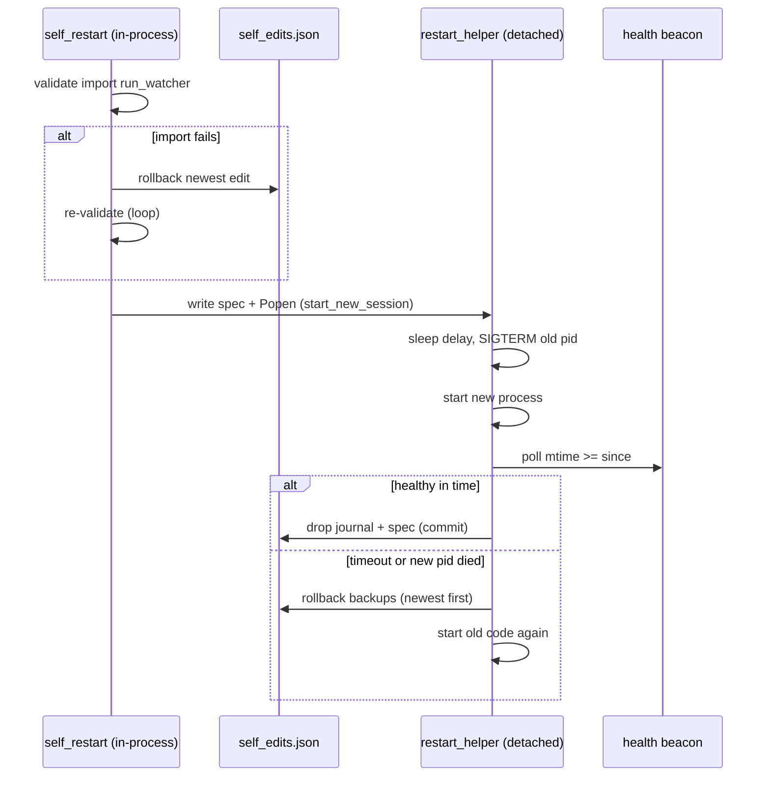

# Safe Self-Restart

> A two-layer guard that lets WatcherDog rewrite its own code and relaunch without ever leaving itself down: a pre-flight import check that rolls back bad edits, plus a detached stdlib supervisor that watches a health beacon and restores the old code if the new process never comes up.

Part of [[Home]].

When [[The Agent]] edits WatcherDog's own source (the self-edit tools), the only safe way to apply that change is to relaunch the process. Doing that naively risks a broken edit taking the bot permanently offline. WatcherDog solves this with two cooperating layers across `watcherdog/self_restart.py` and `watcherdog/restart_helper.py`, both pure stdlib.

## Layer 1 — pre-flight validation (`self_restart.py`)

`request_restart(cfg)` is the orchestrator:

1. **Enable gate.** If `cfg.bot_self_restart_enabled` is false it returns `{error: ...}` immediately and does nothing else.
2. **Validate the import.** `validate(root, python)` runs `python -c "import run_watcher"` in a fresh subprocess (cwd = project root, interpreter = `sys.executable`) and returns `(ok, detail)`.
3. **Roll back until it imports.** While validation fails, `_rollback_latest(cfg)` pops the newest entry from the `self_edits.json` journal and restores its backup bytes (or deletes a newly-created file), then re-validates. The loop continues until the project imports OR there is nothing left to roll back — in which case it **refuses to restart**, leaving the running process on its old in-memory code.
4. **Hand off.** On success it either reports the rolled-back files or calls `_launch_helper(_spec(...))`, which serializes a spec to `restart_spec.json` and `Popen`s the detached supervisor with `start_new_session=True`.

Supporting helpers: `record_edit` appends journal entries (`{path_abs, backup}`); `mark_healthy(cfg)` writes `pid + timestamp` to the health beacon (`cfg.watcher_health_path`, default `data/watcher_healthy`) once the watcher is fully up. `mark_healthy` is called at the very end of [[The Monitor Loop]]'s `run()`.

> [!warning]
> The enable-gate short-circuit is in code but absent from the docs' restart flow: `request_restart` returns an error dict and does nothing when `BOT_SELF_RESTART_ENABLED` is false. Neither [[DOCUMENTATION]] section 4.5 nor [[README]]'s self-restart bullet mentions this gate.

> [!warning]
> `mark_healthy()` only writes "pid timestamp" — it contains NO trigger logic. [[DOCUMENTATION]] line 152 says the beacon is touched 'after "Listening for ibo"'; that coupling lives in the caller (`run_watcher` / `mcp_watcher.run`), not in `self_restart.py`.

The `_spec` it writes carries: `pid`, `python`, `root`, `argv`, `logfile`, `health_path`, `edits_path`, `delay=6`, `health_timeout=45`.

## Layer 2 — the detached supervisor (`restart_helper.py`)

`restart_helper.py` is invoked as `python -m watcherdog.restart_helper <spec.json>` and **deliberately imports nothing from `watcherdog`** (pure stdlib only) so it survives a self-edit that broke the package import. `main()`:

1. Loads the spec, sleeps `delay`.
2. `_stop`s the old pid: SIGTERM, wait up to `grace=10`s, then SIGKILL.
3. `_start`s the new process (also `start_new_session=True`; stdout/stderr appended to the logfile).
4. `_wait_healthy` polls the health beacon's mtime — it must be **≥ the relaunch time `since`** — until `health_timeout` or the new pid dies.
5. **If healthy:** drops the journal and spec, committing the edit.
6. **If not healthy:** stops the new process, `_rollback`s the journalled backups (newest first), and `_start`s once more — so a bad edit can never leave the bot down.

> [!info]
> The two layers are complementary: layer 1 catches an edit that won't even **import**; layer 2 catches an edit that imports but won't **stay up**. Together they make self-modification fail-closed.

## Path derivation gotcha

> [!warning]
> `self_edits_path` and `watcher_health_path` are NOT configurable through their own getters — they are derived from `os.path.dirname(self.db_path)` (the `data/` directory). Moving `DB_PATH` moves these too, and any `SELF_EDITS_PATH` / `WATCHER_HEALTH_PATH` keys in `.env.example` would be ignored. See [[Configuration]] and [[Data and State]].

> [!warning]
> `self_restart._spec` sets `health_timeout=45`, but `restart_helper.main` defaults to **40** if the key is missing. They only agree because `_spec` always supplies 45 — a hand-written spec missing the key would use 40.

> [!warning]
> `validate()` returns only the LAST 1500 chars of stderr/stdout (`out[-1500:]`). A long import traceback is truncated in the error reported back to the user.

## Relaunch mechanics and deployment caveat

The relaunch is a same-launch via `sys.argv` + `sys.executable`.

> [!warning]
> Under **launchd** this double-launches (launchd would also try to restart the supervised process). Self-restart should be **disabled in a launchd-managed deployment**. See [[Running WatcherDog]] and the legacy-deployment notes in [[Legacy Modes]].

## How a self-edit flows end to end

A self-edit by [[The Agent]] records `{path_abs, backup}` into `self_edits.json`, then a restart request flows through `request_restart` → `validate` → rollback-until-importable → detach `restart_helper` → SIGTERM/KILL the old pid → relaunch → wait for `mark_healthy()` to touch `watcher_health_path`. If the new process never becomes healthy, the supervisor restores the backups and relaunches the previous code.

> [!warning]
> Fresh-checkout reminder: there is no `data/` directory yet, so `data/self_edits.json`, `data/watcher_healthy`, and `data/restart_spec.json` are all created at runtime on first write.
## State files

- `data/self_edits.json` — the edit journal (backups for rollback).
- `data/watcher_healthy` — the health beacon (`pid + timestamp`).
- `data/restart_spec.json` — the serialized hand-off spec for the supervisor.

All are detailed in [[Data and State]].

## See also

- [[The Agent]] — produces the self-edits that trigger a restart
- [[Configuration]] — the enable gate and the db-dir-derived paths
- [[Data and State]] — the journal, beacon, and spec files
- [[The Monitor Loop]] — calls `mark_healthy` once the relaunch is fully up
- [[Running WatcherDog]] — why self-restart and launchd don't mix
- [[Two Identities One Process]] — the single process this layer safely relaunches
