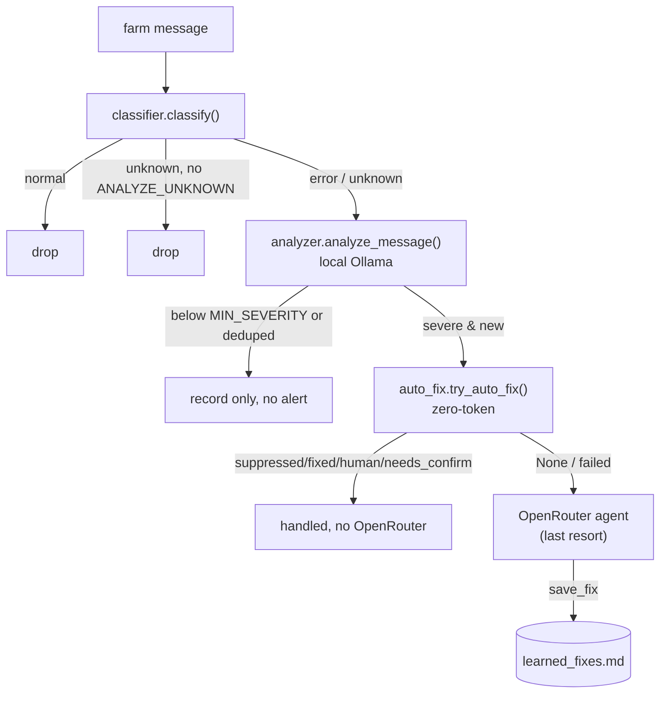

# Script-First AI-Last

> Every farm-bot message runs through cheap deterministic stages — a regex classifier, a local Ollama triage, and a zero-token learned-fix router — and the expensive OpenRouter model is spent only on genuinely novel errors.

Part of [[Home]].

This is WatcherDog's governing philosophy ([[Architecture Overview]]). Four modules implement the error-escalation ladder: `classifier.py`, `analyzer.py`, `auto_fix.py`, and [[The Learned-Fixes Brain|learned_fixes.py]]. The whole point is to keep the model spend near zero for the errors WatcherDog has seen before.

> [!info] Panel monitoring & recovery is fully deterministic — no AI at all
> Beyond the error ladder below, the per-panel watch/recover path (`panel_rules.py` + `panel_actions.py`, gated by `PANEL_RULES_ENABLED`) is a pure decision engine (rules R1–R6) that reads each panel's parsed status and presses recovery buttons with **zero model calls** — the Telegram port of the on-PC `Watchdog.exe`. It runs even **destructive** recoveries (R1 Kill→relaunch) **autonomously by default** (`PANEL_AUTO_DESTRUCTIVE=true`) and reports each episode as one `Panel | Issue | Fixed/Not` line; it NEVER routes a panel recovery through the agent. The OpenRouter agent is reserved for genuinely novel errors and free-form questions; the routine "is this panel healthy / how do I recover it" loop never touches AI. See [[Monitoring and Recovery Rules]].

> [!warning] In the owner's runtime AI is OFF (`DISABLE_AI=true`)
> The deterministic preference is the *operating mode*, not just a fallback: the owner runs WatcherDog with `DISABLE_AI=true`, which is **fully model-free** — no Ollama triage, no OpenRouter agent, no legacy Hermes CLI bridge, and `ANALYZE_UNKNOWN=false`. Everything below the OpenRouter tier (classifier, learned-fix router, panel recovery, commands, drop-stats, screenshots, reports, alerts) still runs; an unresolved novel error becomes a plain alert instead of an agent turn. So treat Tier 1 (Ollama) and Tier 3 (OpenRouter) as **reserved / optional** capability — present in the code, off in the runtime — not the default path. See [[The Agent]], [[The Learned-Fixes Brain]].

## The four tiers

| Tier | Stage | Model? | Tokens? |
|------|-------|--------|---------|
| 0 | `classify(text)` — `_ERROR_RE` / `_NORMAL_RE` buckets | none | none |
| 1 | `analyze_message` — Ollama `/api/chat`, `format=json` | local | none (API) |
| 2 | `try_auto_fix` — re-classify + `find_fix` + press buttons | none | none |
| 3 | `agent.answer` — OpenRouter ([[The Agent]]) | remote | yes |

> [!warning] "Script-first BEFORE any LLM" is accurate only if "LLM" means the OpenRouter agent. In `mcp_watcher._evaluate_bot` the local Ollama `analyze_message` runs FIRST (to get `is_error`/severity), and `try_auto_fix` runs LATER — after the severity + dedupe gates, and only when `cfg.agent_actions_enabled and deliver`. The deterministic router is "first" only relative to the OpenRouter escalation. README:70-73 / DOCUMENTATION L38-41 blur this.

## Tier 0 — the classifier prefilter

`classifier.classify(text)` returns one of three buckets via two precompiled regex unions:
- `_ERROR_RE` (`error`, `failed`, `ban(ned)`, `captcha`, `steam ?guard`, `2fa`, `timeout`, emoji markers ⚠/❌/🛑) wins immediately → `"error"`.
- Otherwise tag/tree-glyph lines are dropped via `_is_tag_or_tree` (bare `[SinFermera3]` tags, tree chars `├└┌┐│─➙→•-`); if every remaining meaningful line matches `_NORMAL_RE` (`collected drop`, `warmup started`, `match ended with score`, price tails, wear tiers) → `"normal"`. A message that is only tags/glyphs is also `"normal"`; empty/whitespace → `"normal"`.
- Anything else → `"unknown"`.

`bot_name_from(text)` extracts the leading `[name]` tag, else `"unknown-bot"`.

## Tier 1 — local Ollama triage

`analyzer.py` is the ONLY one of the four modules that touches a model, and it is Ollama, NOT OpenRouter. It POSTs to `/api/chat` with `format=json`, `temperature=0`, `stream=False` using pure-stdlib `urllib`. `analyze_message(...)` returns `{is_error, severity, summary, root_cause, fix}`; `analyze(...)` is the traceback variant minus `is_error`. Both NEVER raise — `_fallback` returns a high-severity stub when Ollama is unreachable or emits non-JSON, so an error is never silently dropped.

> [!info] `DISABLE_AI=true` is fully model-free mode. It bypasses the analyzer, synthesizes `{is_error: True, severity: 'high'}` from the raw text, skips OpenRouter `agent.answer`, disables the legacy Hermes CLI bridge, and forces `ANALYZE_UNKNOWN=false`. The deterministic router still runs; unresolved incidents become plain alerts instead of agent turns. Default Ollama model, when enabled, is `huihui_ai/gemma-4-abliterated:e4b` (`config.py:70`).

## Tier 2 — the deterministic router

`auto_fix.try_auto_fix(...)` is async but spends ZERO tokens. It re-checks `classify(text)`, then calls `learned_fixes.find_fix`. The full contract is **FIVE outcomes**, not the four the docs list:

| Status | Meaning | Action |
|--------|---------|--------|
| `None` | no mapping, or fix has free-text-only steps, or re-buckets as `normal` | escalate to AI once |
| `suppressed` | action in `_IGNORE` `{ignore,none,noop,no-op,skip,suppress}` | drop silently |
| `fixed` | mapped steps pressed OK | report + `daily_report.record` |
| `human` | `type: human` | alert owner, don't act |
| `needs_confirm` | destructive step (`tg_actions.is_destructive`) NOT marked `auto: yes` | post a [[Confirm and Action Buttons|confirm card]] / ask |
| `failed` | a step errored / `need_confirm` | log `result="failed"`, escalate |

> [!warning] DOCUMENTATION's status table (L68-73) and README prose (L93-101) list only four outcomes and OMIT `needs_confirm`. The module docstring lists all five correctly. Also: `is_destructive` matches truncated Telegram labels (`s..own`, `s...own` for Shutdown) via substring, so it can over-trigger on labels containing `kill`/`restart`.

## Tier 3 — the last resort

Only on `None`/`failed`/unposted-confirm does control fall through to the OpenRouter agent ([[The Agent]]) via `_incident_via_agent` (or a one-way `format_alert`). When `DISABLE_AI=true`, that fall-through is blocked and the one-way alert path is used. With models enabled, the agent fixes the novel error and calls `save_fix` (which is literally `learned_fixes.append_fix`, `agent.py:741`) to write a runnable action — so the NEXT occurrence is handled router-only at Tier 2, never touching the model again. That virtuous loop is the entire payoff of [[The Learned-Fixes Brain]].

> [!warning] "Once — then it remembers" (README:6-7) and "a known error costs zero tokens" (README:72) are accurate for the OpenRouter agent. But the local Ollama triage still runs per message first (no API tokens, but a model call). `classify()` + `find_fix()` are the only stages that touch no model at all.

## See also
- [[Monitoring and Recovery Rules]] — the parallel, fully-deterministic panel watch/recover engine (R1–R6, no AI).
- [[The Learned-Fixes Brain]] — the Markdown memory that makes Tier 3 a one-time cost.
- [[The Agent]] — the Tier 3 OpenRouter escalation that writes new fixes.
- [[The Monitor Loop]] — where `_evaluate_bot` wires the four tiers together.
- [[Confirm and Action Buttons]] — how `needs_confirm` becomes a tap.
- [[Configuration]] — `MIN_SEVERITY`, `DEDUPE_WINDOW`, `DISABLE_AI`, `OLLAMA_*`.
- [[Home]] — the vault index.
