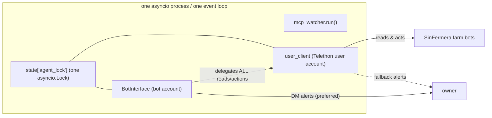

# Two Identities One Process

> One asyncio process logs into Telegram twice — as the owner's MTProto user account (so it can read other bots) and optionally as a Bot-API bot (so it can talk to humans and DM alerts) — sharing one event loop and one agent lock.

Part of [[Home]].

WatcherDog runs a single process ([[Architecture Overview]]) that holds two distinct Telegram identities. They exist because of a hard platform constraint and a soft delivery preference.

## Why two identities

The Telegram **Bot API forbids a bot from reading another bot's messages**. The SinFermera farm bots are bots, so a bot account literally cannot see what they say. Therefore the reading half must be an MTProto **user account** (Telethon). The talking half is an ordinary **bot account** — better for human DMs, inline buttons, and a BotFather command menu.

| Identity | Library / API | Can read farm bots? | Role |
|----------|---------------|---------------------|------|
| User account (owner) | Telethon / MTProto | Yes | Reads watch folder, presses panel buttons, can send alerts |
| Bot account (optional) | Telethon as bot (`sign_in(bot_token=...)`) | No | Talks to humans, inline buttons, preferred alert DM channel |

## The bot delegates everything to the user account

`bot_interface.BotInterface` ([[The Bot Front-End]]) logs in as a separate Telethon BOT client on the SAME event loop, but it cannot read farm bots. So EVERY read and EVERY panel action it performs is delegated to the injected `user_client`. When someone taps a [[Confirm and Action Buttons|confirm button]], the bot's `_run_card_steps` presses the mapped labels on the **user account**, never on the bot.

## One loop, one lock

Both identities live in the same `asyncio` loop. A single `asyncio.Lock` — `state["agent_lock"]` — serializes EVERY agent invocation across the monitor's incident handler, the ibo listener, the [[The Monitor Loop|Special Forces listener]], and the bot. Only one agent question runs at a time.

> [!info] The lock is acquired LAZILY inside `agent.answer` — only the moment it first presses a panel button. Read-only turns (status, reports, questions) never queue; only real panel-driving serializes. See [[The Agent]].

## Alerts prefer the bot DM

When the bot starts successfully, `run()` records `state["post_card"]` (for inline-button cards) and, if `cfg.bot_alerts` and an owner id resolved, `state["notifier"]` so proactive alerts are DMed by the bot. The `_alert` helper prefers `state["notifier"]` and silently falls back to the user account if the bot notifier is missing or fails. See [[Alerts and Heartbeat]].

> [!warning] A bot can only DM a user who has pressed Start. `notify_owner` returns `False` (never raises) so the monitor falls back to the user account. Neither README nor DOCUMENTATION mentions that the bot DM is the PREFERRED alert channel — DOCUMENTATION only notes the owner must press Start.

## Session reuse

The watcher reuses the **telegram-mcp's session string** when it has no file session of its own (`_resolve_session_string`), so the user account can run without a separate login. See [[Configuration]] (`TELEGRAM_SESSION`, `TELEGRAM_SESSION_STRING`) and [[Entry Points]] for the login tooling.

> [!tip] Run continuously. With `--once` the watcher does a single sweep WITHOUT starting the bot, listeners, or any scheduled task — the bot identity is only wired up in continuous mode. See [[Running WatcherDog]].

## See also
- [[The Bot Front-End]] — the human-facing identity that delegates to the user account.
- [[The Monitor Loop]] — the loop both identities share.
- [[The Agent]] — serialized by the single shared agent lock.
- [[Alerts and Heartbeat]] — bot-DM-first delivery with user-account fallback.
- [[Configuration]] — session, token, and bot-enable keys.
- [[Home]] — the vault index.
