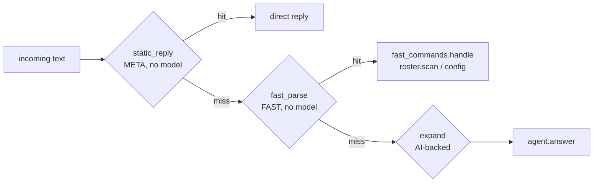

# Commands

> WatcherDog's three command layers — deterministic FAST (no model), AI-backed slash commands, and META replies — that intercept human input before any LLM runs.

Part of [[Home]].

The command surface lives in `watcherdog/commands.py` and `watcherdog/fast_commands.py`, dispatched by `_on_message` in [[The Bot Front-End]]. `commands.py` is pure string work — no Telegram, no model — which makes it trivially unit-testable (see [[Testing]]). The same three layers also drive the ibo listener in [[The Monitor Loop]] (`commands.static_reply`, `commands.fast_parse` -> `fast_commands.handle`, then `commands.expand` -> `agent.answer`).

## The three layers

### Layer 1 — FAST (deterministic, NO LLM)

`commands.FAST_MENU` / `fast_parse` resolve a small set of commands that `fast_commands.handle` answers off a fresh `roster.scan` (see [[Roster and Health Scan]]), the `daily_report` fix log, or config — never the model.

| Command | Aliases | Answered from |
|---------|---------|---------------|
| `/status` | — | `roster.scan` |
| `/problems` | `/down` | `roster.scan` |
| `/silent` | — | `roster.scan` |
| `/fixes` | — | `daily_report` (the auto-fix log) |
| `/mode` | `/health` | config |

`fast_parse` returns `(canonical, args)` and does NOT expand into a prompt. `fast_commands.handle` runs exactly one deterministic command: `/fixes` (`daily_report`), `/mode` (config), or a fresh `roster.scan` for `/status`, `/problems`, `/silent`.

### Layer 2 — AI-backed slash commands

`commands.MENU` / `COMMANDS` / `expand` turn farm-facing slash commands into rich **prompt strings** fed to `agent.answer` (see [[The Agent]]).

| Command | Notes |
|---------|-------|
| `/weekly` | alias `/drops` |
| `/today` | daily rollup |
| `/top` / `/worst` | rankings |
| `/value` | drop value |
| `/check N` | check a specific bot |
| `/bans` | ban report |
| `/compare` | comparison |
| `/improve` | admin self-edit (see [[Safe Self-Restart]]) |
| `/whatsnew` | recent changes |

> [!info] `/improve` is shown only in help
> `/improve` is an AI-backed command in `commands.MENU` (admin self-edit) but is NOT advertised in `build_bot_commands`' fast/meta extras — it surfaces only via `build_help`'s MENU loop. Drop-stats (`/weekly`) routing also has a deterministic fast-path in [[The Monitor Loop]] via `_DROP_STATS_RE` for the ibo channel; see [[Drop-Stats Pipeline]].

### Layer 3 — META (no LLM, direct reply)

`static_reply` answers meta commands directly with no model:

| Command | Builder |
|---------|---------|
| `/start` | `build_welcome` |
| `/help`, `/commands` | `build_help` (loops `MENU` so `/improve` appears here) |
| `/job`, `/jobs` | `build_jobs` (reads `task_store.active`) |

`is_stop` matches `/stopjobs`, `/stopall`, `/canceljobs`; `friendly_title` derives the live status header from the command (`_TITLES`) or the free-form text. `JOB_NAMES = {job, jobs}` — both are handled by `build_jobs`.

> [!tip] `/stopjobs` vs `/job` are different layers
> `/job(s)` is a META `static_reply` (no model) that just lists `task_store.active`. `/stopjobs` is handled earlier by `is_stop` -> `_handle_stopjobs`, which cancels in-flight asyncio tasks AND clears the task store, gated to action-authorized users. See [[The Bot Front-End]].

## Where each layer reads its data

- FAST commands hit `roster.scan` ([[Roster and Health Scan]]) or the `daily_report` auto-fix log ([[Scheduled Reports]]).
- AI-backed commands become prompts for [[The Agent]], which reads Telegram via the user account ([[Telegram Tools and Actions]]).
- META commands read `task_store` (the persistence layer in [[The Bot Front-End]]).

> [!warning] Test count is stale in the root docs
> `README.md` line 265 and `DOCUMENTATION.md` line 278 both claim "412 tests"; the verified ground truth is 302 test functions across 29 files in `tests/`. See [[Testing]] and [[README]].

> [!info] BotFather menu vs help text differ slightly
> `DOCUMENTATION.md`'s command table lists only `/job` under meta, but `build_jobs`/`static_reply` also handle `/jobs`. The installed BotFather menu (`build_bot_commands`) and `build_help` are built from overlapping but not identical sets — `/improve` is help-only.

## See also

- [[The Bot Front-End]] — the router that dispatches these three layers
- [[Confirm and Action Buttons]] — inline buttons for action confirmation
- [[The Agent]] — what AI-backed `expand` prompts are fed to
- [[Roster and Health Scan]] — the no-LLM scan behind FAST `/status` etc.
- [[Scheduled Reports]] — the daily fix log read by `/fixes`
- [[Drop-Stats Pipeline]] — the `/weekly` drop-stats job
