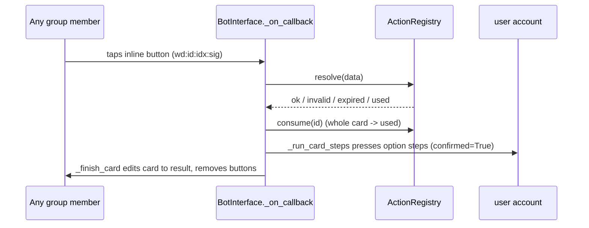
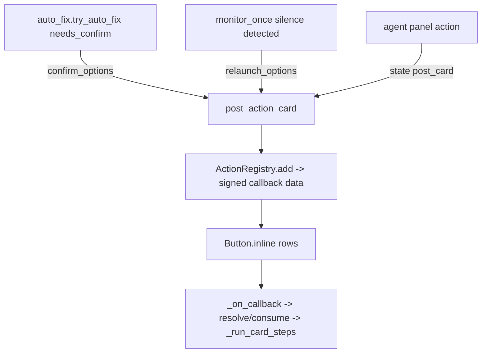

# Confirm and Action Buttons

> WatcherDog's inline-button system: signed, single-use, expiring callback tokens that let any group member tap a one-tap panel action — the token is the authorization, deliberately Telethon-free so it unit-tests cleanly.

Part of [[Home]].

Inline buttons live in `watcherdog/buttons.py` and are surfaced by `_on_callback` / `_run_card_steps` in [[The Bot Front-End]]. The core is `buttons.ActionRegistry`, a Telethon-free registry of pending action cards: it mints signed callback data, resolves taps, enforces single-use, and garbage-collects expired cards. Cards are how the deterministic `auto_fix` router in [[Script-First AI-Last]] asks a human "do it?" without spending a token, and how a silent bot offers a one-tap relaunch in [[The Monitor Loop]].

## The signed token model

`post_action_card` calls `actions.add(target, options, title)`, which mints a random `action_id` (`os.urandom(6).hex()`) and builds callback data per option:

```
wd:<action_id>:<idx>:<10-hex HMAC-SHA256 sig>
```

`BotInterface` wraps each `(label, data)` row into `Button.inline`. A tap hits `_on_callback`, which calls `actions.resolve(data)` returning one of **invalid / expired / used / ok**.



`ActionRegistry.sign / parse / resolve / consume / purge`:

- **sign** — HMAC-SHA256, truncated to 10 hex, verified with `hmac.compare_digest`. Proves WE minted the button.
- **resolve** — checks ttl + `used` + idx bounds.
- **consume** — marks the WHOLE card `used` up-front.
- **purge** — GCs cards where `now - created > ttl` (`action_card_ttl`, default 900s).

## Security and single-use

> [!warning] Anyone in the group may tap — the token is the authorization
> The signed token, not the user id, is the authorization. Any group member can press a posted button; the presser is logged. Forged or tampered callback data fails `ActionRegistry.parse` (`hmac.compare_digest`) and resolves to `invalid`.

> [!warning] Double-tap is rejected by consuming the whole card
> Single-use is enforced by consuming the ENTIRE card up-front (`entry["used"] = True` via `ActionRegistry.consume`) BEFORE running any steps — a fast double-tap of any option on the same card is rejected as `used`.

> [!warning] Tokens do not survive a restart
> The per-run signing secret is `os.urandom(16).hex()`, so tokens do NOT survive a restart — old cards become `invalid` after a restart. This is separate from ttl expiry. See [[Safe Self-Restart]].

## Running the steps

On `ok`, the mapped `option["steps"]` are pressed on the **user account** via `tg_actions.press_button(..., confirmed=True)` inside `_run_card_steps`, holding `state["agent_lock"]` so panel turns stay serialized (the same shared lock from [[The Monitor Loop]]). The result is logged via `daily_report.record` (see [[Scheduled Reports]]), then the card is edited to its result and buttons removed (`_finish_card`). The `confirmed=True` flag is exactly what `tg_actions.is_destructive` requires to allow a destructive button — see [[Telegram Tools and Actions]].

## Option presets

`buttons.py` ships option presets and a no-op test:

| Preset | Buttons it yields |
|--------|-------------------|
| `relaunch_options()` | 🔁 Relaunch / 📸 Screenshot / ✋ Skip |
| `confirm_options()` | a do-label / ✋ Skip |
| `is_noop()` | True when an option has empty `steps` |

`relaunch_options` is posted by the silence path in [[The Monitor Loop]] when a bot goes quiet; `confirm_options` is posted by the deterministic router's `needs_confirm` outcome in [[Script-First AI-Last]].

> [!warning] README confirm-card layout is illustrative
> `README.md` shows a confirm card with three buttons including "[ 🔁 Restart instead ]". The actual presets do not produce that exact layout — `relaunch_options()` is Relaunch / Screenshot / Skip and `confirm_options()` is a do-label / Skip. The README example is illustrative, not a literal preset. See [[README]].

> [!tip] No-op taps are skipped, not run
> In `_on_callback`, an option resolving to a no-op (empty steps) is skipped rather than pressed — useful for a "Skip" button that just consumes the card.

## Where cards come from



The monitor stores `state["post_card"]` at startup so the incident handler can post cards; see [[The Monitor Loop]] and [[Confirm and Action Buttons]]'s consumer in [[The Bot Front-End]].

> [!warning] Test count is stale in the root docs
> `README.md` line 265 / `DOCUMENTATION.md` line 278 claim "412 tests"; ground truth is 302 test functions across 29 files. See [[Testing]].

## See also

- [[The Bot Front-End]] — `_on_callback` / `_run_card_steps` consume these cards
- [[Script-First AI-Last]] — the `needs_confirm` router outcome that posts confirm cards
- [[The Monitor Loop]] — silence relaunch cards and the shared `agent_lock`
- [[Telegram Tools and Actions]] — `press_button(confirmed=True)` and `is_destructive`
- [[Safe Self-Restart]] — why button tokens become invalid after a restart
- [[Commands]] — the command layers that share the bot front-end
