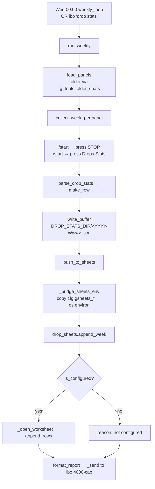

# Drop-Stats Pipeline

> Hermes skill 5: the weekly Wednesday-00:00 job that drives each panel bot to stop farms and pull Drops Stats, buffers one JSON file per ISO week, and pushes rows to Google Sheets through an optional, lazily-imported `gspread`/`google-auth` sink that no-ops cleanly until configured.

Part of [[Home]].

The drop-stats pipeline lives in two modules: `watcherdog/drop_stats.py` (the panel-driving job + pure helpers) and `watcherdog/drop_sheets.py` (the Google Sheets transport). It is one of the scheduled side-jobs spawned by [[The Monitor Loop]] and listed in [[Scheduled Reports]], but it is the only one that actively presses panel buttons over Telethon rather than just summarizing state.

## The weekly job

`run_weekly(client, cfg, target=None, *, deliver=True, now=None)` (`drop_stats.py`) orchestrates one full run: resolve the ISO week, `load_panels`, `collect_week`, `write_buffer`, `push_to_sheets`, `format_report`, then optionally `_send` the report to a target (truncating to 4000 chars; honoring `deliver=False` for dry-run). It returns `{week, rows, push, path}`.

`weekly_loop(client, cfg, target=None, *, deliver=True)` is the scheduler: sleep `seconds_until` the next Wednesday 00:00, `run_weekly`, catch+log any exception, then sleep 60s to step past the trigger minute before re-arming. It is started as a background task in `mcp_watcher.py:951`.

> [!info] Schedule constants
> `RUN_WEEKDAY = 2` (Wednesday), `RUN_HOUR = 0`, `RUN_MINUTE = 0`. `seconds_until(now, ...)` returns a strictly-future delay — landing exactly on the mark schedules a full week out. The same `seconds_until` is reused by the [[Scheduled Reports|weekly digest loop]].

### On-demand trigger

Besides the Wednesday cron, the job fires on demand when ibo sends a message matching `_DROP_STATS_RE = \bdrops?\s+stats\b` — the ibo listener (`mcp_watcher.py:445-450`) routes "drop stats" straight to `drop_stats.run_weekly`. See [[The Monitor Loop]] and [[Commands]] (the `/drops` alias).

## Driving the panels

`collect_week` loops the panels and, inside a per-panel `try/except`, calls `stop_farm` then `request_drop_stats`. A dead panel never blocks the rest — it still gets a blank row with `notes="no reply"`.

The Telethon button primitives (shared with [[Telegram Tools and Actions|tg_actions]]):

| Helper | Role |
|---|---|
| `load_panels` | resolves the PANELS folder via `tg_tools.folder_chats` + `client.get_entity`; degrades to `[]` (logged) on failure |
| `_open_menu` | sends `/start` and waits via `_await_reply` |
| `_await_reply` | polls `get_messages(limit=6)` for a newer incoming message (optionally one with inline buttons); 20s default timeout, 1.5s poll |
| `_press` | clicks the first inline button whose lowercased label *starts with* any prefix in `STOP_BUTTONS` / `DROPS_BUTTONS` |
| `stop_farm` | opens the menu, presses a `STOP_BUTTONS` control |
| `request_drop_stats` | opens the menu AGAIN, presses `Drops Stats`, returns the reply text |

```
STOP_BUTTONS  = ("kill all cs", "kill all", "stop the farm", "stop farm", "stop")
DROPS_BUTTONS = ("drops stats", "drop stats", "drops")
```

> [!warning] Two `/start` round-trips per panel
> `stop_farm` sends `/start` and presses stop; `request_drop_stats` sends `/start` AGAIN (a second `_open_menu`) — it does not reuse the first menu. So each panel gets two `/start` round-trips, not one shared session.

> [!tip] Label-prefix matching, order matters
> Buttons match by lowercased label PREFIX because Telegram truncates inline labels. Tuple order matters — `"kill all cs"` is listed before `"kill all"` so the more specific label wins first.

## Pure helpers (unit-testable, no Telethon)

| Symbol | Behaviour |
|---|---|
| `iso_week(dt)` | canonical `YYYY-Www` id used for the buffer filename and ibo's report header |
| `buffer_path(dir, week)` | joins the week id under the drop-stats dir |
| `panel_label(name)` | maps a chat display name to `Panel#N` via the first digit run |
| `parse_drop_stats(text)` | lenient regex extraction of drops/items/value; each missing field returns `""` |
| `make_row(week, panel, parsed, *, date)` | assembles a dict keyed by `drop_sheets.COLUMNS` |
| `write_buffer` / `load_buffer` | persist/reload the per-week JSON (write never raises — OSError is logged) |
| `format_report(week, rows, push)` | renders ibo's "🐕 Weekly drops" message; tail line varies by push status |

`format_report`'s tail line: `saved to Sheets ✅` on ok; `buffered, no API key yet` when the reason is `not configured`; otherwise `buffered (<reason>)`.

> [!warning] Silent extraction
> `parse_drop_stats` is heuristic regex. If a panel changes its wording, fields silently come back `""` (no error) and the row still writes. The local JSON buffer is kept regardless of the Sheets outcome.

## The Google Sheets sink (`drop_sheets.py`)

`COLUMNS = ["week", "date", "panel", "drops", "items", "value", "notes"]` fixes both the row-dict keys and the sheet column order.

`append_week(rows)` is the public entry and NEVER raises:

| Return | When |
|---|---|
| `{"ok": True, "written": 0}` | no rows |
| `{"ok": False, "reason": "not configured"}` | sheet id unset OR creds file missing on disk |
| `{"ok": False, "reason": "gspread not installed"}` | `ModuleNotFoundError` on lazy import |
| `{"ok": False, "reason": "<Type>: <err>"}` | any other open/append failure |
| `{"ok": True, "written": N}` | success — `append_rows(payload, value_input_option="USER_ENTERED")` |

`_open_worksheet()` is the actual auth/transport: it lazily `import gspread` and `from google.oauth2.service_account import Credentials` *inside the function*, builds `Credentials.from_service_account_file(creds_path, scopes=["https://www.googleapis.com/auth/spreadsheets"])`, calls `gspread.authorize(creds)`, `gc.open_by_key(sheet_id)`, then `sh.worksheet(tab)` — creating the tab with a header row on `WorksheetNotFound`.

> [!warning] Two sources of truth for the same settings
> `Config` reads `GSHEETS_*` into `cfg.gsheets_*`, but `drop_sheets._cfg()` reads `os.environ` DIRECTLY — not the Config object. They only agree because `push_to_sheets` calls `_bridge_sheets_env(cfg)` to copy the resolved `cfg.gsheets_*` into the environment immediately before `append_week`. Calling `drop_sheets.append_week()` outside `drop_stats.push_to_sheets` would silently ignore Config and see only raw env vars. See [[Configuration]].

> [!warning] It's a service account, not an API key
> Despite "no API key yet" wording in `format_report` and the docs, auth is a Google SERVICE-ACCOUNT JSON key (`Credentials.from_service_account_file`) — not interactive OAuth and not an API key. `is_configured()` is true only when the sheet id is set AND the creds file actually EXISTS on disk; a configured-but-missing-file state reports `not configured`, not an error.

> [!warning] Unpinned optional dependency
> `gspread` and `google-auth` are the ONLY third-party libs this subsystem uses beyond Telethon, and NEITHER is in `requirements.txt` or `requirements-dev.txt`. Install is documented only as a comment: `pip install gspread google-auth`. Until then `append_week` returns `{"ok": False, "reason": "gspread not installed"}` and the run still buffers + reports. `requirements.txt` pins only `telethon>=1.36`. Neither [[README]] nor [[DOCUMENTATION]] flags this as optional/unmanaged.

## End-to-end flow



> [!info] Runtime-created paths
> The buffer `DROP_STATS_DIR/<YYYY-Www>.json` (default `data/hermes/drop_stats/`) is created lazily by `write_buffer` (`os.makedirs`). This is a fresh checkout with NO `data/` directory — every drop-stats path is created on first run. See [[Data and State]].

## See also

- [[Scheduled Reports]] — the other clock-driven side-jobs sharing `seconds_until`
- [[The Monitor Loop]] — spawns `weekly_loop` and routes the on-demand trigger
- [[Telegram Tools and Actions]] — the button-press primitives this reuses
- [[Configuration]] — `PANELS_FOLDER`, `DROP_STATS_DIR`, `GSHEETS_*` keys
- [[Data and State]] — the per-week buffer + credentials file
- [[Hermes Skills]] — drop-stats is skill 5 ([[05-drop-stats]])
