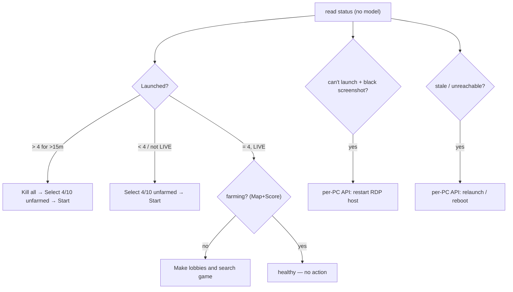

# Monitoring and Recovery Rules

> The deterministic rules WatcherDog applies to each FSM panel — what to watch in the [[Panel Control Bot]] status message and which buttons to press to recover. This is the port of the on-PC `Watchdog.exe` logic to Telegram, with **no AI in the loop** (see [[Script-First AI-Last]] and the rules-over-AI preference).

Part of [[Home]]. Detection reads the [[Panel Control Bot]] status; actions go through [[Telegram Tools and Actions]] and, for destructive steps, [[Confirm and Action Buttons]]. Cold cases the bot can't fix are handed to a thin **per-PC API agent** (see [[Legacy Modes]] for the `Watchdog.exe` it descends from).

## Constants

| Name | Value | Source |
|------|-------|--------|
| Target accounts per panel | **4** (must not exceed) | operator |
| Over-launch persistence before acting | **15 min** | operator |
| Canonical selection action | **Select 4/10 unfarmed** (never *Select first 4/10 accs*) | operator |
| Weekly drop-stats slot | **Wednesday 00:00**, with **0 launched** | operator / [[Drop-Stats Pipeline]] |
| Destructive (always confirm) | Kill all CS & Steam · Restart panel · Reboot PC · Shutdown PC | [[Confirm and Action Buttons]] |

## Detection signals (parsed, no model)

From each panel's [[Panel Control Bot|status message]]: `Launched: N`, `Status`, `Map`+`Score` (in-match ⇒ farming), `Total`, `Updated` (freshness), plus free-text alerts like `All 8 accounts launched!`.

Free-text match-search failures are deterministic too: `[SinFermeraN] Can't find match in X minutes. Changing batch...` means the panel may be alive but the launched accounts are not finding games. WatcherDog opens `/start`, captures the account names from the panel menu/status, presses `Screenshot`, and alerts ibo with both the account list and screenshot path.

## Alive vs dead — when a panel is "down" (owner spec)

Deterministic, **no model / OCR needed**:
- **Any message = alive.** A status card, or `Can't find match in X minutes. Changing batch…`, both prove the panel/PC is working — the second just means it couldn't find a game (handled by **R3b**, not a failure).
- **Total silence > `PANEL_STALE_MINUTES` (default 70 min) = dead.** Only when a panel posts *nothing at all* for that long is it **panel/PC down → needs PC**. The report says how long: `SinFermera## | silent 73m (dead) | NOT fixed ❌ → needs PC`.
- This is pure **last-message timing** — the same way the on-PC Watchdog decides (timestamp of the last log line); the watcher gets that timestamp free from Telegram. Black-screen is the separate **pixel** check (R4 / the PC tool), not this.

## The recovery rules

| # | Condition | Action sequence | Notes |
|---|-----------|-----------------|-------|
| **R1** | `Launched > 4` sustained **> 15 min** | `Kill all CS & Steam` → `Select 4/10 unfarmed` → `Start selected accounts` | Replaces the unreliable per-PC 5-min relaunch script. Kill-all is less overhead than de-selecting. Destructive — **auto-runs by default** (`PANEL_AUTO_DESTRUCTIVE=true`). |
| **R2** | `Launched < 4` or not `LIVE` | `Select 4/10 unfarmed` → `Start selected accounts` | Restore to exactly 4. |
| **R3** | `LIVE` but **not farming** (no/stale `Map`+`Score`) | `Make lobbies and search game` | Farm should auto-start but sometimes "sits there". |
| **R3b** | `Can't find match in X minutes. Changing batch...` | `Screenshot` + alert account names from `/start` | Flags panels whose games may never be found even though the bot keeps speaking. |
| **R4** | Accounts won't launch / inconsistent **and** `Screenshot` is a **black image** | → **per-PC API**: close/restart the self-hosted **RDP-session host** software, then re-verify | The RDP host "screen bugs out"; closing it self-heals. (The bugged script lives in the panel-tools repo — to fix later.) |
| **R5** | **Wednesday 00:00** (weekly) | `Kill all CS & Steam` (ensure 0 launched) → `Drop Stats` → after it completes, `Run activity booster` | End-of-week stats need 0 launched; auto drop-stats isn't guaranteed 100%. See [[Drop-Stats Pipeline]]. |
| **R6** | **Total silence > 70 min** (`PANEL_STALE_MINUTES`) — no message of ANY kind | → **per-PC API**: relaunch panel exe / RDP reconnect / reboot; reports `silent Nm (dead)` | Any message — incl. "can't find match… changing batch" — resets the clock and means alive. Only true silence = dead. See *Alive vs dead* above; ties to [[Alerts and Heartbeat]]. |

> [!info] Autonomous by default; confirm is opt-in
> With `PANEL_AUTO_DESTRUCTIVE=true` (the default) R1's `Kill all`→relaunch executes autonomously and the bot reports the outcome (see below). Set `PANEL_AUTO_DESTRUCTIVE=false` to instead offer R1 as a one-tap [[Confirm and Action Buttons|confirm button]] that anyone in the group can tap.

> [!tip] Confirm with a Screenshot before acting
> Mirror the on-PC babysitter and `docs/hermes/skills/02-error-handling.md`: read a `Screenshot` between escalation steps so a destructive action isn't taken on a misread status.

## How a recovery is reported

Each recovery episode produces ONE concise line to the [[Configuration|allow-list]] — not per-sweep chatter:

- `SinFermera13 | over-launch | Fixed ✅` — the panel returned healthy after an action.
- `SinFermera15 | 0/4 launched | NOT fixed ❌ → needs PC (3 relaunches failed)` — escalated as a cold case.

**Retry-cap → cold case.** A frozen RDP host can't be fixed from Telegram, so the engine never loops forever: after `PANEL_MAX_ATTEMPTS` (default 3) failed Kill→Start cycles it stops acting and escalates the panel as **needs PC**, then stays quiet until it recovers. **R4** (black screenshot) and **R6** (down/stale) escalate immediately via the same one-line format. The per-PC RDP tool (closes/reopens the frozen `wfreerdp` window) is what actually clears these — see R4/R6.

> [!info] Cold cases are handed to the PC-side repo
> **R4** (black screen) and **R6** (dead / total silence) are *cold cases*: the Telegram watcher only **detects + reports** them as "needs PC" — it does NOT and CANNOT fix them from Telegram. The actual on-PC repair (close/reopen the frozen RDP-session host, relaunch the panel exe, reboot) lives in the separate repo `github.com/AdxamAxatov/Watchdog` (`Boot.exe`), the descendant of the legacy on-PC `Watchdog.exe` (see [[Legacy Modes]]). R1–R3b stay fully in WatcherDog's deterministic loop.

## See also
- [[Panel Control Bot]] — the status format + button vocabulary these rules use
- [[Telegram Tools and Actions]] — executes the button presses
- [[Drop-Stats Pipeline]] — the R5 weekly sequence
- [[Confirm and Action Buttons]] — gates the destructive steps
- [[The Monitor Loop]] — where the per-panel evaluation runs each sweep
- [[Home]] — knowledge-base index
