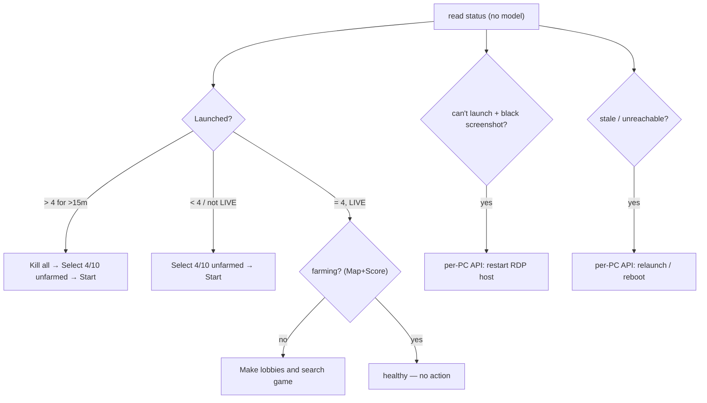

# Monitoring and Recovery Rules

> The deterministic rules WatcherDog applies to each FSM panel — what to watch in the [[Panel Control Bot]] status message and which buttons to press to recover. This is the port of the on-PC `Watchdog.exe` logic to Telegram, with **no AI in the loop** (see [[Script-First AI-Last]] and the rules-over-AI preference).

Part of [[Home]]. Detection reads the [[Panel Control Bot]] status; actions go through [[Telegram Tools and Actions]] and, for destructive steps, [[Confirm and Action Buttons]]. Cold cases the bot can't fix are handed to a thin **per-PC API agent** (see [[Legacy Modes]] for the `Watchdog.exe` it descends from).

## Constants

| Name | Value | Source |
|------|-------|--------|
| Target accounts per panel | **4** (must not exceed) | operator |
| Over-launch persistence before acting | **15 min** | operator |
| Canonical selection action | **Select 4/10 unfarmed** (never *Select first 4/10 accs*) | operator |
| Weekly drop-stats slot | **Wednesday 00:00**, with **0 launched** | operator / [[Drop-Stats Pipeline]] |
| Destructive (always confirm) | Kill all CS & Steam · Restart panel · Reboot PC · Shutdown PC | [[Confirm and Action Buttons]] |

## Detection signals (parsed, no model)

From each panel's [[Panel Control Bot|status message]]: `Launched: N`, `Status`, `Map`+`Score` (in-match ⇒ farming), `Total`, `Updated` (freshness), plus free-text alerts like `All 8 accounts launched!`.

Free-text match-search failures are deterministic too: `[SinFermeraN] Can't find match in X minutes. Changing batch...` means the panel may be alive but the launched accounts are not finding games. WatcherDog opens `/start`, captures the account names from the panel menu/status, presses `Screenshot`, and alerts ibo with both the account list and screenshot path.

## The recovery rules

| # | Condition | Action sequence | Notes |
|---|-----------|-----------------|-------|
| **R1** | `Launched > 4` sustained **> 15 min** | `Kill all CS & Steam` → `Select 4/10 unfarmed` → `Start selected accounts` | Replaces the unreliable per-PC 5-min relaunch script. Kill-all is less overhead than de-selecting. ⚠ destructive → confirm. |
| **R2** | `Launched < 4` or not `LIVE` | `Select 4/10 unfarmed` → `Start selected accounts` | Restore to exactly 4. |
| **R3** | `LIVE` but **not farming** (no/stale `Map`+`Score`) | `Make lobbies and search game` | Farm should auto-start but sometimes "sits there". |
| **R3b** | `Can't find match in X minutes. Changing batch...` | `Screenshot` + alert account names from `/start` | Flags panels whose games may never be found even though the bot keeps speaking. |
| **R4** | Accounts won't launch / inconsistent **and** `Screenshot` is a **black image** | → **per-PC API**: close/restart the self-hosted **RDP-session host** software, then re-verify | The RDP host "screen bugs out"; closing it self-heals. (The bugged script lives in the panel-tools repo — to fix later.) |
| **R5** | **Wednesday 00:00** (weekly) | `Kill all CS & Steam` (ensure 0 launched) → `Drop Stats` → after it completes, `Run activity booster` | End-of-week stats need 0 launched; auto drop-stats isn't guaranteed 100%. See [[Drop-Stats Pipeline]]. |
| **R6** | Status stale / bot unreachable (panel or PC down) | → **per-PC API**: relaunch panel exe / RDP reconnect / reboot | Telegram can't reach a dead bot — escalate to the cold-case agent. Ties to [[Alerts and Heartbeat]] silence detection. |

> [!warning] Confirm before every destructive step
> R1's `Kill all` (and any Restart/Reboot/Shutdown) is offered as a one-tap [[Confirm and Action Buttons|confirm button]], never fired blind — same gate the rest of WatcherDog uses.

> [!tip] Confirm with a Screenshot before acting
> Mirror the on-PC babysitter and `docs/hermes/skills/02-error-handling.md`: read a `Screenshot` between escalation steps so a destructive action isn't taken on a misread status.

## See also
- [[Panel Control Bot]] — the status format + button vocabulary these rules use
- [[Telegram Tools and Actions]] — executes the button presses
- [[Drop-Stats Pipeline]] — the R5 weekly sequence
- [[Confirm and Action Buttons]] — gates the destructive steps
- [[The Monitor Loop]] — where the per-panel evaluation runs each sweep
- [[Home]] — knowledge-base index
