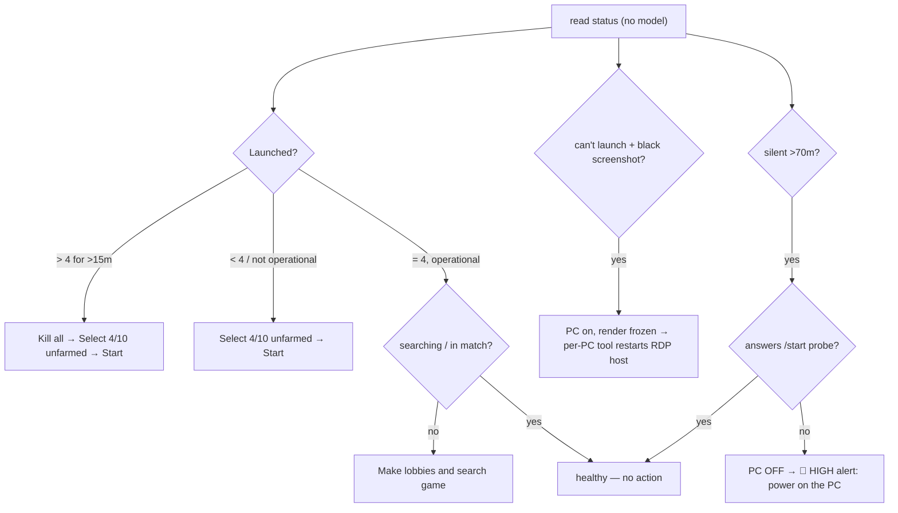

# Monitoring and Recovery Rules

> The deterministic rules WatcherDog applies to each FSM panel — what to watch in the [[Panel Control Bot]] status message and which buttons to press to recover. This is the port of the on-PC `Watchdog.exe` logic to Telegram, with **no AI in the loop** (see [[Script-First AI-Last]] and the rules-over-AI preference).

Part of [[Home]]. Detection reads the [[Panel Control Bot]] status; actions go through [[Telegram Tools and Actions]] and, for destructive steps, [[Confirm and Action Buttons]]. Cold cases the bot can't fix are handed to a thin **per-PC API agent** (see [[Legacy Modes]] for the `Watchdog.exe` it descends from).

## Constants

| Name | Value | Source |
|------|-------|--------|
| Target accounts per panel | **4** (must not exceed) | operator |
| Over-launch persistence before acting | **15 min** | operator |
| Canonical selection action | **Select 4/10 unfarmed** (never *Select first 4/10 accs*) | operator |
| Weekly drop-stats slot | **Wednesday 00:00**, with **0 launched** | operator / [[Drop-Stats Pipeline]] |
| Destructive (always confirm) | Kill all CS & Steam · Restart panel · Reboot PC · Shutdown PC | [[Confirm and Action Buttons]] |

## Detection signals (parsed, no model)

From each panel's [[Panel Control Bot|status message]]: `Launched: N`, `Status`, `Map`+`Score` (in-match ⇒ farming), `Total`, `Updated` (freshness), plus free-text alerts like `All 8 accounts launched!`.

Free-text match-search failures are deterministic too: `[SinFermeraN] Can't find match in X minutes. Changing batch...` means the panel may be alive but the launched accounts are not finding games. WatcherDog opens `/start`, captures the account names from the panel menu/status, presses `Screenshot`, and alerts ibo with both the account list and screenshot path.

## Alive vs dead — when a panel is "down" (owner spec)

Deterministic, **no model / OCR needed**:
- **Any message = alive.** A status card, or `Can't find match in X minutes. Changing batch…`, both prove the panel/PC is working — the second just means it couldn't find a game (handled by **R3b**, not a failure).
- **Silence is a *trigger to probe*, not a verdict.** When a panel posts *nothing at all* for `PANEL_STALE_MINUTES` (default 70 min), WatcherDog does **not** assume death — it actively **`/start`-probes** the panel (`PANEL_PROBE_ENABLED`, default on; `PANEL_PROBE_TIMEOUT`, default 15s). A reply (the menu/status card) proves the panel **and** its PC are alive, so it is **not** flagged. *Why:* a healthy panel can sit quiet between batches for >70 min yet answer `/start` in seconds — silence alone false-flagged live panels (e.g. SinFermera19).
- **No `/start` reply ⇒ the PC is OFF ⇒ HIGH alert.** For the bot to answer, the FSM Panel app on that PC must be running, which needs the **PC on and networked**. So *silent **and** ignoring `/start`* means the app is unreachable — the PC is powered off (or Windows hard-crashed / the app died / that site's internet dropped). **Nothing automated can fix a powered-off machine** (the on-PC tool isn't running either), so this is the urgent, human-only case: `🚨 SinFermera## | PC OFF / unreachable — no /start reply (silent 73m) | HIGH ❌ → needs PC (power on)`. Recovery = a human powers it on (or Wake-on-LAN / smart-plug). This is **different from R4** (black screen), where `/start` *does* reply (PC on) but the render froze and the per-PC tool can self-heal it.
  - The probe is **debounced** (`PANEL_ACTION_DEBOUNCE_SECONDS`) so an idle panel isn't `/start`-ed every sweep, and a probe that **errors on the watcher side** (FloodWait / network) is treated as **inconclusive — not dead** (it retries next window, no false PC-OFF alert).
  - When a flagged PC comes back (it posts anything again), the bot confirms once: `✅ SinFermera## | back online`.
- **Operational vs down is explicit.** A status is *operational* (no relaunch) when it reads `LIVE` / `Searching game…` / in-match; an explicit **down marker** (`OFFLINE`, `Not live`, `stopped`, `error`, …) always wins, so a readable down-state still relaunches (R2) even though its text may contain a word like "live".
- **First sweep seeds quietly.** On the first sweep after a (re)start, already-silent panels are recorded but never probed or alerted, so a restart with the fleet quiet overnight can't flood. Probing/alerting begins on later sweeps.
- The freshness clock is the **last Telegram message timestamp** (the watcher gets it free); the `/start` probe is the liveness confirmation layered on top. Black-screen is the separate **pixel** check (R4 / the PC tool), not this. `/start` is **non-destructive** — it only opens the menu.

## The recovery rules

| # | Condition | Action sequence | Notes |
|---|-----------|-----------------|-------|
| **R1** | `Launched > 4` sustained **> 15 min** | `Kill all CS & Steam` → `Select 4/10 unfarmed` → `Start selected accounts` | Replaces the unreliable per-PC 5-min relaunch script. Kill-all is less overhead than de-selecting. Destructive — **auto-runs by default** (`PANEL_AUTO_DESTRUCTIVE=true`). |
| **R2** | `Launched < 4`, or a readable status that is **not operational** (e.g. `OFFLINE`) | `Select 4/10 unfarmed` → `Start selected accounts` | Restore to exactly 4. **Operational** = `LIVE`, `Searching game…`, or in-match — all healthy, never relaunched (a `Searching` panel was previously misread as not-`LIVE` and wrongly relaunched). |
| **R3** | **operational** but **not farming or searching** (no/stale `Map`+`Score`, and not already `Searching game…`) | `Make lobbies and search game` | Farm should auto-start but sometimes "sits there". An already-`Searching` panel is left alone. |
| **R3b** | `Can't find match in X minutes. Changing batch...` | `Screenshot` + alert account names from `/start` | Flags panels whose games may never be found even though the bot keeps speaking. |
| **R4** | Accounts won't launch / inconsistent **and** `Screenshot` is a **black image** | → **per-PC API**: close/restart the self-hosted **RDP-session host** software, then re-verify | The RDP host "screen bugs out"; closing it self-heals. (The bugged script lives in the panel-tools repo — to fix later.) |
| **R5** | **Wednesday 00:00** (weekly) | `Kill all CS & Steam` (ensure 0 launched) → `Drop Stats` → after it completes, `Run activity booster` | End-of-week stats need 0 launched; auto drop-stats isn't guaranteed 100%. See [[Drop-Stats Pipeline]]. |
| **R6** | **Silence > 70 min** (`PANEL_STALE_MINUTES`) **AND** no reply to a `/start` probe | → **HIGH alert: the PC is OFF / unreachable — power it on** (human / Wake-on-LAN). A powered-off PC can't be fixed by software (the on-PC tool isn't running). Reports `🚨 … \| PC OFF / unreachable … \| HIGH ❌ → needs PC (power on)`. | A `/start` reply (or any message — incl. "can't find match… changing batch") proves it's alive and resets the clock. Only silence **that also ignores `/start`** = dead. First sweep seeds quietly. **Not** R4: there `/start` replies (PC on) but the screen is black. See *Alive vs dead*; ties to [[Alerts and Heartbeat]]. |

> [!info] Autonomous by default; confirm is opt-in
> With `PANEL_AUTO_DESTRUCTIVE=true` (the default) R1's `Kill all`→relaunch executes autonomously and the bot reports the outcome (see below). Set `PANEL_AUTO_DESTRUCTIVE=false` to instead offer R1 as a one-tap [[Confirm and Action Buttons|confirm button]] that anyone in the group can tap.

> [!tip] Confirm with a Screenshot before acting
> Mirror the on-PC babysitter and `docs/hermes/skills/02-error-handling.md`: read a `Screenshot` between escalation steps so a destructive action isn't taken on a misread status.

## How a recovery is reported

Each recovery episode produces ONE concise line to the [[Configuration|allow-list]] — not per-sweep chatter:

- `SinFermera13 | over-launch | Fixed ✅` — the panel returned healthy after an action.
- `SinFermera15 | 0/4 launched | NOT fixed ❌ → needs PC (3 relaunches failed)` — escalated as a cold case.

**Retry-cap → cold case.** A frozen RDP host can't be fixed from Telegram, so the engine never loops forever: after `PANEL_MAX_ATTEMPTS` (default 3) failed Kill→Start cycles it stops acting and escalates the panel as **needs PC**, then stays quiet until it recovers. **R4** (black screenshot) and **R6** (silent + no `/start` reply) escalate immediately via the same one-line format. The two cold cases have **different fixers**: an **R4** panel is *on* (it answered Telegram) but its render froze → the per-PC tool closes/reopens the frozen `wfreerdp` window and self-heals it; an **R6** panel is *off* → no software can touch it, a human must power it on.

> [!info] Cold cases — and which can be auto-fixed
> The Telegram watcher only **detects + reports** cold cases; it does NOT fix them from Telegram. But they are not equal:
> - **R4 (black screen)** — `/start` still replies, so the **PC is on**; only the RDP render bugged out. The per-PC tool (`Boot.exe` in `github.com/AdxamAxatov/Watchdog`, descendant of the legacy `Watchdog.exe`) closes/reopens the frozen `wfreerdp` window and **auto-heals** it.
> - **R6 (PC off)** — `/start` gets nothing, so the **PC is off / unreachable**. `Boot.exe` runs *on* that PC, so it can't help — **only a power-on fixes it** (human, Wake-on-LAN, or smart-plug). Hence the **HIGH** alert.
>
> R1–R3b stay fully in WatcherDog's deterministic Telegram loop.

## See also
- [[Panel Control Bot]] — the status format + button vocabulary these rules use
- [[Telegram Tools and Actions]] — executes the button presses
- [[Drop-Stats Pipeline]] — the R5 weekly sequence
- [[Confirm and Action Buttons]] — gates the destructive steps
- [[The Monitor Loop]] — where the per-panel evaluation runs each sweep
- [[Home]] — knowledge-base index
