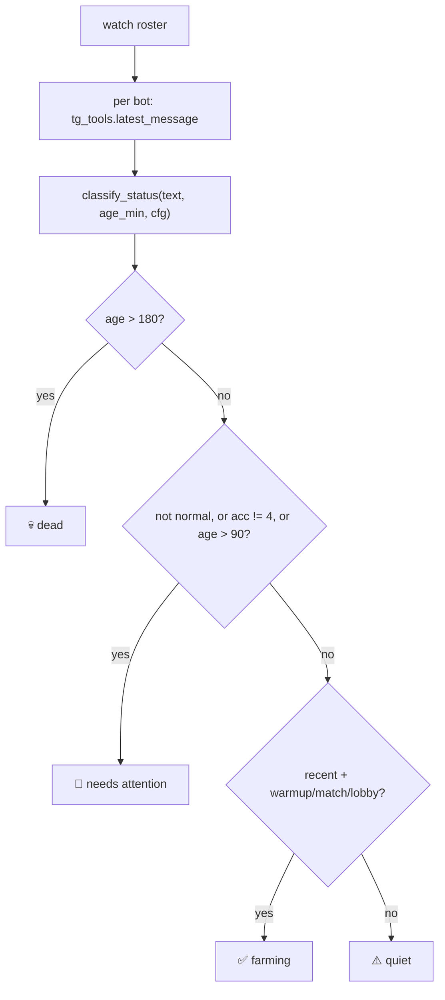

# Roster and Health Scan

> The deterministic, NO-LLM "how is each bot doing" scanner (`roster.py`) that buckets every farm bot into FARMING / QUIET / ATTENTION / DEAD — plus the SQLite incident store (`storage.py`) whose `recurring()` query powers the recurring-error watchdog.

Part of [[Home]].

`watcherdog/roster.py` answers the question "what's the live status of every bot?" without spending a single token. It is shared by the hourly report ([[Scheduled Reports|run_hourly_report]]) and the fast slash-commands `/status`, `/problems`, `/silent` ([[Commands]] via `fast_commands.py`). `watcherdog/storage.py` is the incident memory the [[The Monitor Loop|monitor loop]] dedupes against and the recurring-error job groups over.

## roster.scan — the no-LLM health scan

`scan(client, cfg, watch)` (`roster.py:101`, async) reads each bot's latest message over Telethon ([[Telegram Tools and Actions|tg_tools.latest_message]]) and returns `{bot_num: {pc, status, age_min, name}}`.

## classify_status thresholds

`classify_status(text, age_min, cfg)` (`roster.py:84`) buckets a bot using cheap heuristics on top of [[Script-First AI-Last|classifier.classify]]:

| Condition | Status |
|-----------|--------|
| `age_min > 180` | `💀 dead` (`DEAD`) |
| non-`normal` bucket OR `acc != 4` OR `age_min > 90` | `🔴 needs attention` (`ATTENTION`) |
| recent + farming keyword (`warm up`/`match`/`lobby` via `_FARMING_KEYWORDS`) | `✅ farming` (`FARMING`) |
| else | `⚠️ quiet` (`QUIET`) |

`extract_account_count(text)` (`roster.py:41`) parses the account count out of the message.

> [!warning] The "healthy" account count is hard-coded to 4
> `classify_status` treats `acc != 4` as needs-attention. This is NOT configurable — it is a literal in `roster.py`. (Skill 4 is "four accounts per panel".)

> [!tip] A single dead read never blocks the scan
> Each bot is read inside try/except; a per-bot read error is swallowed (treated as very old). Bots whose name has no number are skipped entirely.

## PC mapping (load_pc_map)

`load_pc_map(cfg)` (`roster.py:65`) loads `data/farmer_pc_map.json` into `bot_number → PC`, accepting either `{PC: [bots]}` or `{bot: PC}` (normalized via `_invert_pc_map`). Returns `{}` (logged) on any error. The hourly report groups bots by PC for a compact per-PC status block.

> [!warning] The PC map is cached for the process lifetime
> `load_pc_map` caches into the module-global `_pc_map_cache` (`roster.py:33`). Editing `data/farmer_pc_map.json` at runtime has NO effect until restart.

## storage.py — the incident store

`IncidentStore` (`watcherdog/storage.py`) is a SQLite database (`data/incidents.db`, `cfg.db_path`). `_init_schema` creates an `incidents` table (`ts, bot, severity, summary, root_cause, fix, raw_hash, raw_excerpt, notified`) with an index on `(raw_hash, ts)`.

| Method | Role |
|--------|------|
| `record` | inserts one incident row; `raw_excerpt` truncated to 4000 chars; `notified` reflects whether an alert was actually sent |
| `last_seen(raw_hash)` (`:41`) | newest `ts` for a hash — the dedupe primitive |
| `recurring(window, min_count)` (`:73`) | `GROUP BY raw_hash HAVING COUNT(*) >= ?` within a trailing window |

### Dedupe and the recurring query

The dedupe key is `raw_hash` = `error_hash(text)`. Crucially, `error_hash`/`normalize_error` live in `watcherdog/monitor.py`, NOT in `storage.py` — they strip timestamps, hex addresses, "line N", and bare integers so the same bug hashes identically. `storage.py` only stores and queries the resulting `raw_hash`.

`recurring()` returns groups with bots via `GROUP_CONCAT(DISTINCT bot)` plus the latest severity/summary/raw_excerpt, feeding [[Scheduled Reports|_recurring_loop]] → [[Alerts and Heartbeat|format_recurring_alert]].

> [!warning] error_hash is in monitor.py, not storage.py
> DOCUMENTATION says `storage.py` provides "de-dup via error_hash". The hashing/normalization actually lives in `watcherdog/monitor.py`; `storage.py` only stores/queries the hash. The description of WHAT is normalized is correct.

> [!info] Below-MIN_SEVERITY incidents are still stored
> The [[The Monitor Loop|monitor]] records sub-threshold incidents with `notified=False`. They never alert, but they DO count toward the `recurring()` grouping — a stream of low-severity repeats can still trip the recurring watchdog.

> [!warning] Two separate dedupe mechanisms
> The dedupe WINDOW check (`DEDUPE_WINDOW`) is in `mcp_watcher._evaluate_bot` using `last_seen`. The recurring-error COOLDOWN is tracked in-memory in `_recurring_loop` (`state["recurring_alerted"]`). Don't conflate the two.

## Config keys

| Key | Effect |
|-----|--------|
| `DB_PATH` | incident store SQLite path |
| `DEDUPE_WINDOW` | suppress identical hashes within N seconds (default 300) |
| `QUIET_THRESHOLD_MINUTES` | quiet vs farming boundary |
| `RECURRING_ERROR_WINDOW` / `RECURRING_ERROR_MIN_COUNT` | the `recurring()` window and threshold |
| `HOURLY_REPORT_CHAT` / `HOURLY_REPORT_TOPIC` | where the roster report is posted |

See [[Configuration]] and [[Data and State]] for the full picture.

> [!warning] No `data/` directory on a fresh checkout
> `incidents.db` and `farmer_pc_map.json` are created at runtime; on a fresh clone the `data/` tree does not exist yet.

## See also

- [[Scheduled Reports]] — `run_hourly_report` and `_recurring_loop` consume `roster.scan` and `store.recurring`
- [[The Monitor Loop]] — dedupes against `last_seen`, records every incident via `store.record`
- [[Alerts and Heartbeat]] — `format_recurring_alert` renders a `recurring()` group
- [[Commands]] — `/status`, `/problems`, `/silent` answer off a fresh `roster.scan`
- [[Telegram Tools and Actions]] — `tg_tools.latest_message` reads each bot's last message
- [[Data and State]] — `incidents.db` and `farmer_pc_map.json` runtime files
