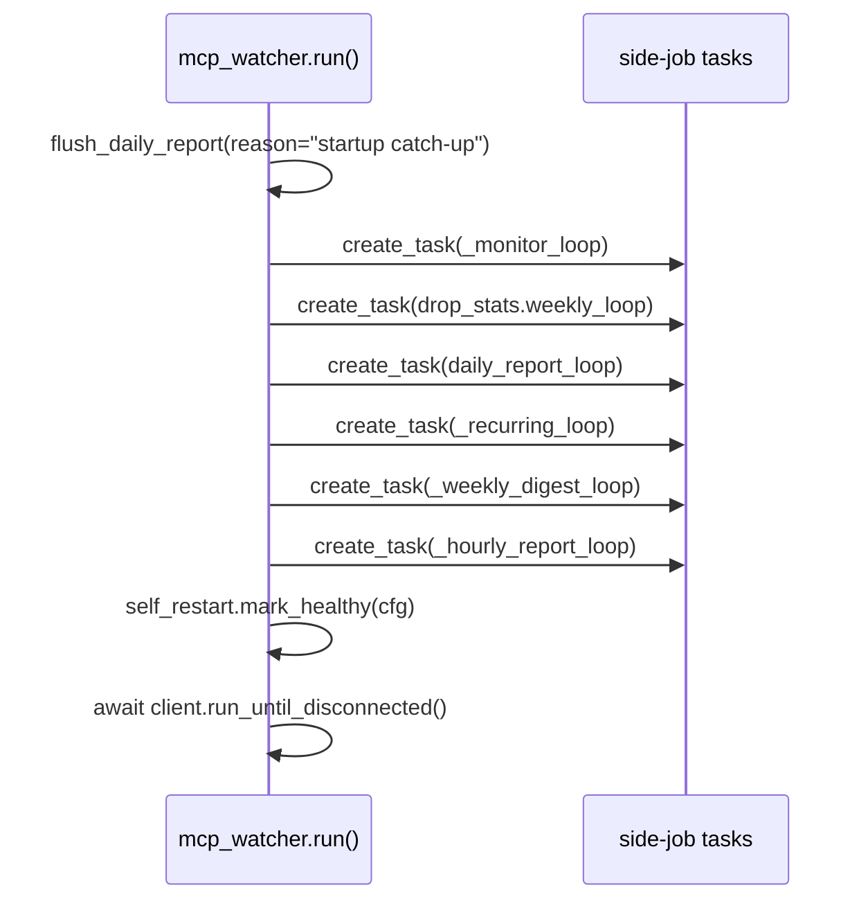

# Scheduled Reports

> The recurring, clock-driven side-jobs WatcherDog spawns alongside [[The Monitor Loop]]: hourly status rollups, the recurring-error watchdog, the weekly digest, and the end-of-day auto-fix report.

Part of [[Home]].

WatcherDog's sweep is only half the story. When it runs in continuous mode, `mcp_watcher.run()` spawns a fleet of long-running background tasks (`asyncio` coroutines) that wake on their own schedules and emit reports — independent of any single farm-bot message. They all read the same shared state the [[The Monitor Loop|monitor]] uses: the [[Roster and Health Scan|roster]] scan, the [[Data and State|IncidentStore]], and the [[The Learned-Fixes Brain|daily-errors auto-fix log]]. This note covers the four "report"-flavoured loops; the Wednesday drop-stats job has its own note ([[Drop-Stats Pipeline]]).

> [!info] These loops are continuous-mode only
> A `--once` run does exactly one `monitor_once` sweep and returns `0` WITHOUT starting the bot, the listeners, or ANY scheduled task. Every loop below is wired up only in the long-running path (see [[Entry Points]] and [[Running WatcherDog]]).

## The schedule at a glance

| Loop | Symbol (`watcherdog/mcp_watcher.py`) | Cadence | Gate flag | Emits |
|---|---|---|---|---|
| Sweep | `_monitor_loop` | every `watch_poll_interval` (default 120s) | — | drives [[The Monitor Loop]] |
| Hourly report | `_hourly_report_loop` → `run_hourly_report` | 30s after start, then top of every hour | `hourly_report_enabled` | per-PC status to `hourly_report_chat` |
| Recurring-error | `_recurring_loop` | every `RECURRING_ERROR_INTERVAL` (900s) | `recurring_error_enabled` | "🔁 Recurring error" alerts |
| Weekly digest | `_weekly_digest_loop` → `run_weekly_digest` | `WEEKLY_DIGEST_WEEKDAY` (6=Sun) @ `WEEKLY_DIGEST_HOUR` (18) | `weekly_digest_enabled` | read-only `/weekly` summary to ibo |
| Daily report | `daily_report_loop` → `flush_daily_report` | `DAILY_REPORT_TIME` (default 23:59) + startup catch-up | — | end-of-day auto-fix rollup |
| Drop-stats | `drop_stats.weekly_loop` | Wednesday 00:00 | — | see [[Drop-Stats Pipeline]] |

## Hourly report

`run_hourly_report` (`mcp_watcher.py:671`) is deterministic and spends ZERO model tokens. It calls `roster.scan` (see [[Roster and Health Scan]]), groups bots by PC, and posts a compact status block to `cfg.hourly_report_chat` — optionally inside a forum topic via `reply_to` when `HOURLY_REPORT_TOPIC` is set. It then appends the compact "🔧 Fixed last hour" one-liner built by `daily_report.summary_since`, so a single message shows both current health and what got auto-fixed.

`_hourly_report_loop` (`mcp_watcher.py:773`) sleeps 30s after startup, posts an initial report, then posts once at the top of every clock hour.

> [!tip] Restart-storm guard
> The hourly report has a once-per-clock-hour guard persisted to `data/hourly_report_state.json` (`_hourly_state_path`), so frequent restarts — each of which fires the 30s-after-start report — don't spam the topic. The guard is bypassed in `--dry-run`.

> [!warning] Cosmetic f-string bug
> `mcp_watcher.py:724` builds the "needs attention" bucket note as `f'🔴 SF{bn } {age_str}'` with a stray space inside the braces (`{bn }`), so the rendered text gets an extra space before the age. Harmless, but visible.

## Recurring-error watchdog

`_recurring_loop` (`mcp_watcher.py:503`) wakes every `RECURRING_ERROR_INTERVAL` (900s) and asks the store: which error hashes have repeated `≥ RECURRING_ERROR_MIN_COUNT` within `RECURRING_ERROR_WINDOW`? It uses `IncidentStore.recurring(...)` (a `GROUP BY raw_hash HAVING COUNT >= min_count` query — see [[Data and State]]) and renders each group with `alerter.format_recurring_alert` ("🔁 Recurring error — N× in last M min"). Per-hash alerts are cooldown-gated by `RECURRING_ERROR_COOLDOWN`, tracked in-memory in `state['recurring_alerted']`.

> [!info] Below-threshold errors still count
> Incidents below `MIN_SEVERITY` are still recorded to SQLite with `notified=False`, so they contribute to the recurring grouping even though they never fired an individual alert. See [[Script-First AI-Last]] for the severity gate.

## Weekly digest

`run_weekly_digest` (`mcp_watcher.py:613`) runs the read-only `/weekly` agent summary (see [[The Agent]] and [[Commands]]) and DMs it to ibo. `_weekly_digest_loop` (`mcp_watcher.py:629`) schedules it on `WEEKLY_DIGEST_WEEKDAY` (default 6 = Sunday) at `WEEKLY_DIGEST_HOUR` (default 18:00), computing the delay with `drop_stats.seconds_until` (reused from [[Drop-Stats Pipeline]]).

> [!warning] This is the READ-ONLY digest — it never stops farms
> The weekly digest is a summary only. Do not confuse it with the [[Drop-Stats Pipeline|drop-stats job]], which actively drives panels to stop farms and pull Drops Stats.

> [!warning] Doc drift
> `DOCUMENTATION.md` (line 56) states the digest is "pushed to ibo on Sunday evening" as if fixed — it matches the code defaults only because both weekday and hour are configurable. `README.md` doesn't mention the digest's weekday/time at all (it only lists the keys among commented-out config). See [[Configuration]].

## Daily report

`flush_daily_report` (`mcp_watcher.py:844`) builds the end-of-day rollup from the auto-fix log (`daily_report.build_report` → "🐕 Today — N errors auto-fixed", grouped by `(panel, error, fix, result)` with ×N counts) and ships it. Critically, it calls `daily_report.clear_log()` (zero-byte truncation) ONLY after a successful delivery — a send failure leaves the entries to be retried.

`daily_report_loop` (`mcp_watcher.py:857`) schedules the flush at `DAILY_REPORT_TIME` (default 23:59) via `_seconds_until_daily`. The SAME function is also called once at startup with `reason="startup catch-up"` so any auto-fix log that survived a crash gets delivered before the new day's monitoring begins.

> [!warning] No archive after a clean flush
> `clear_log` truncates `data/hermes/daily_errors.jsonl` to zero bytes once a daily flush succeeds. Delivered entries are gone — there is no archive. (Naive ISO timestamps and lexical comparison underpin `summary_since`/`entries_since`; see [[Data and State]].)

## How the loops are spawned

Every report path that touches the agent shares the single `state['agent_lock']`, so a scheduled digest never races the [[The Monitor Loop|monitor]], the ibo listener, or [[The Bot Front-End|the bot]]. Delivery prefers the bot DM (`state['notifier']`) and falls back to the user account — see [[Alerts and Heartbeat]]. After all tasks are spawned, `self_restart.mark_healthy(cfg)` writes the health beacon that tells the supervisor in [[Safe Self-Restart]] the relaunch came up clean.

## See also

- [[The Monitor Loop]] — spawns every loop here as a background task
- [[Drop-Stats Pipeline]] — the Wednesday job that shares `seconds_until`
- [[Roster and Health Scan]] — the no-LLM scan the hourly report renders
- [[Alerts and Heartbeat]] — bot-DM-first delivery for every report
- [[Data and State]] — the IncidentStore and daily-errors log these read
- [[Configuration]] — every `*_ENABLED` / time / weekday flag
