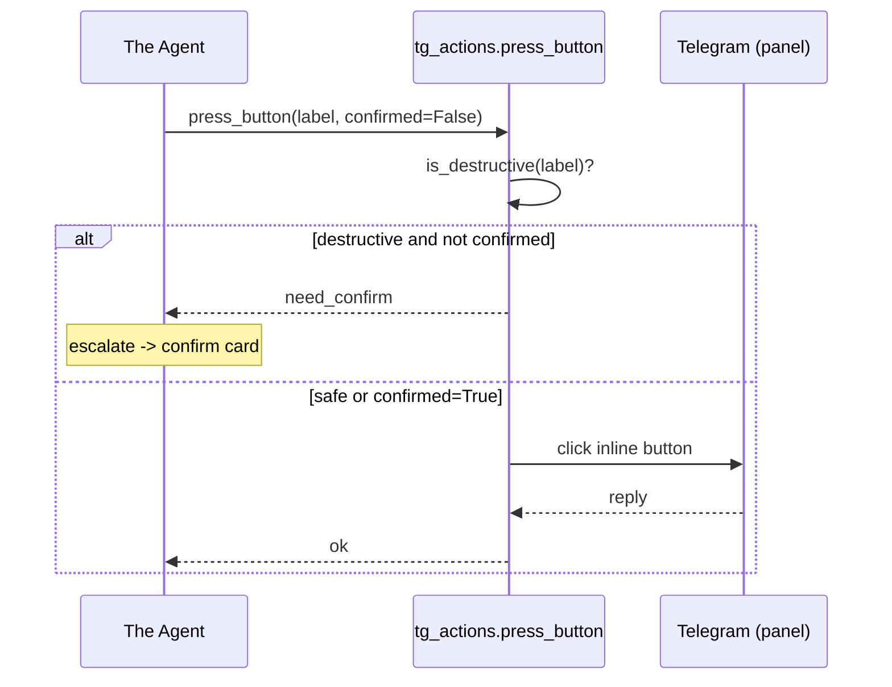

# Telegram Tools and Actions

> The two Telethon layers behind every WatcherDog action: `tg_tools.py` reads chats and folders (never writes), `tg_actions.py` presses panel buttons and refuses destructive ones unless explicitly confirmed.

Part of [[Home]].

WatcherDog cleanly separates **reading** from **acting** into two modules. [[The Agent]] and the rest of the system only touch Telegram through these — keeping the dangerous, side-effecting code in one small, auditable place.

## `tg_tools.py` — the read-only layer

`tg_tools.py` is strictly read-only Telethon helpers. Nothing here changes state on a farm bot or panel:

| Symbol | What it does |
|--------|--------------|
| `list_folders` (`tg_tools.py:45`) | Enumerates the user account's dialog folders |
| `folder_chats` (`tg_tools.py:72`) | Lists the chats inside a named folder |
| `read_history` (`tg_tools.py:98`) | Reads recent messages from a chat |
| `find_chats` (`tg_tools.py:146`) | Resolves chats by name/query |
| `latest_message` | Reads a single bot's latest message (used heavily by sweeps) |

`latest_message` is the workhorse of [[The Monitor Loop]] and [[Roster and Health Scan]]: every sweep and every `roster.scan` reads each watched bot's newest message through it (optionally marking it read via `MARK_READ_AFTER_READ`). [[Drop-Stats Pipeline]] resolves its PANELS folder with `folder_chats`.

> [!info]
> Because `tg_tools.py` performs no writes, read-only agent turns and the proactive roster scan are always safe to run, even under `--dry-run`. They never block on the action lock from [[Two Identities One Process]].

## `tg_actions.py` — the write layer

`tg_actions.py` is where WatcherDog actually presses buttons. It is the ONLY module that mutates a farm panel:

| Symbol | Line | Role |
|--------|------|------|
| `DESTRUCTIVE` | `tg_actions.py:25` | The set of dangerous label markers |
| `is_destructive` | `tg_actions.py:31` | True if a button label looks like kill/restart/reboot/shutdown |
| `panel_menu` | `tg_actions.py:64` | Opens a panel's `/start` menu |
| `press_button` | `tg_actions.py:77` | Clicks a button — refuses unless `confirmed=True` for destructive |
| `send_command` | `tg_actions.py:121` | Sends a slash/text command to a panel |
| `screenshot` | `tg_actions.py:129` | Captures a panel screenshot (button matched by **substring**) |

### The destructive guard

`press_button` uses an **exact-prefix-substring** match against the target label and returns `need_confirm` (instead of pressing) whenever the label is destructive and the caller did not pass `confirmed=True`. This is the hard stop that prevents the agent or a stale card from ever killing a farm without a human in the loop.

> [!warning]
> `is_destructive` matches **truncated** Telegram labels too — e.g. `s..own` / `s...own` for "Shutdown", because Telegram truncates inline button text. It is a substring match, so it can OVER-trigger on labels that merely contain `kill` / `restart`. Erring toward "ask first" is the intended bias, but be aware a benign label could be flagged destructive.

## Button-matching primitives (shared with drop-stats)

Lower-level Telethon button helpers live in [[Drop-Stats Pipeline|drop_stats.py]] and are imported by `tg_actions.py`:

- `_open_menu` — sends `/start` and waits for the menu reply.
- `_await_reply` — polls `get_messages(limit=6)` for a newer incoming message (optionally one carrying inline buttons), 20s default timeout, 1.5s poll.
- `_press` — clicks the first inline button whose lowercased label **prefix-matches** any candidate.

> [!tip]
> Button matching is by lowercased label **prefix** because Telegram truncates inline labels. Order matters: a more specific prefix must be tried before a shorter one (e.g. "kill all cs" before "kill all").

> [!info] `press_button` and `screenshot` match by SUBSTRING, not just prefix
> `tg_actions.press_button` resolves a label in order **exact → prefix → substring** (lowercased), and `tg_actions.screenshot` matches the Screenshot button by plain **substring** (`"screenshot" in label.lower()`). This is deliberately emoji-safe: a real panel button labelled `🖼 Screenshot` has an emoji + space *prefix*, so a strict `startswith("screenshot")` missed it on the live panels. The lower-level `_press` primitive shared with [[Drop-Stats Pipeline|drop_stats]] is still prefix-only — the difference is `tg_actions`'s own matchers are broader.

## How callers reach this layer

These two modules sit beneath several subsystems:

- [[The Agent]] exposes ACTION tools that ultimately call `press_button`; it gates them behind `cfg.agent_actions_enabled` AND the `execute` dry-run flag.
- [[Confirm and Action Buttons]] runs a card's mapped `steps` via `tg_actions.press_button(..., confirmed=True)` once a human taps approve.
- [[The Monitor Loop]]'s [[Script-First AI-Last|deterministic router]] (`auto_fix.try_auto_fix`) executes known fixes through `press_button` and uses `is_destructive` to decide `needs_confirm`.
- [[Drop-Stats Pipeline]] presses STOP and Drops-Stats buttons via the `_press` primitive.

## Configuration and the dry-run contract

Relevant keys (see [[Configuration]]): `MARK_READ_AFTER_READ`, `WATCH_FOLDER`, `WATCH_FOLDER_ID`, `PANELS_FOLDER`, `AGENT_ACTIONS_ENABLED`.

> [!warning]
> The combined safety contract is: a write happens ONLY when `agent_actions_enabled` is true, the caller passed `execute`/`deliver=True`, AND (for destructive buttons) `confirmed=True`. A `--dry-run` watcher satisfies none of the action gates and falls straight through to alert-only behavior — it never presses a real button. See [[The Monitor Loop]] and [[Running WatcherDog]].

> [!info]
> Only `telethon>=1.36` is required here; there is no Bot-API write path in this layer (the bot can't read or act on other bots — it delegates to the user account). See [[Two Identities One Process]].

## See also

- [[The Agent]] — the primary caller of these layers
- [[Confirm and Action Buttons]] — human approval before a destructive press
- [[Script-First AI-Last]] — the deterministic router that executes known fixes here
- [[Drop-Stats Pipeline]] — reuses the `_press` button primitive
- [[The Monitor Loop]] — reads via `latest_message`, acts via this write layer
- [[Module Reference]] — where these modules sit in the package
