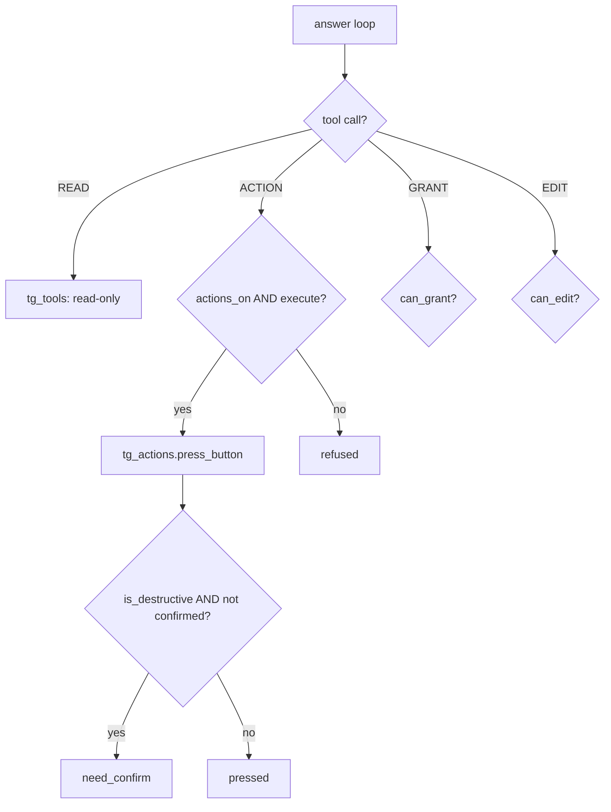

# The Agent

> WatcherDog's tool-calling LLM brain: a pure-stdlib OpenRouter loop that reads chats, drives farm panels, manages access, and can even rewrite and restart itself — all behind capability flags and a dry-run gate.

Part of [[Home]].

`watcherdog/agent.py` is the reasoning engine WatcherDog falls back to when the cheap deterministic stages can't handle an error. It is the "AI-last" tier of [[Script-First AI-Last]]: only genuinely novel errors, free-form ibo questions, and self-improvement requests ever reach it. Every other path — [[The Learned-Fixes Brain]], the classifier, and the deterministic router — runs first and spends zero OpenRouter tokens.

> [!warning] In the owner's runtime this agent is OFF
> The owner runs with `DISABLE_AI=true`, so `agent.answer` is never called: novel incidents become plain alerts, the Special Forces auto-reply and the weekly digest are skipped, and **panel recovery is never routed through the agent** — it stays in the deterministic [[Monitoring and Recovery Rules|R1–R6 engine]]. Treat everything in this note as a **reserved / optional** capability (the model-backed path), present in the code but off by default in production. With AI enabled it behaves as described below.

## The answer loop

`answer(...)` (`agent.py:907`) is the main entry point. It runs an OpenRouter chat-completion loop up to `cfg.agent_max_steps` (default 12) iterations, executing tool calls each turn via `_dispatch` and forcing a final tools-less pass when the step budget is spent. The transport is `_chat_completion` (`agent.py:851`) — a blocking `urllib` POST to OpenRouter's `chat/completions`, pure stdlib with **no SDK**. `tools` + `tool_choice: auto` are only attached when there are tools to advertise.

The default model is `cfg.agent_model` (configurable via `AGENT_MODEL`, default `deepseek/deepseek-v4-pro`) reached at `cfg.agent_api_base` (OpenRouter).

> [!warning]
> Two docs disagree on the model name. `run_watcher.py` docstring (line 9) and [[README]] line 95 say "deepseek via OpenRouter" as if hard-coded. The real model is `cfg.agent_model` (the `AGENT_MODEL` key), not pinned to deepseek. See [[Configuration]].

> [!warning]
> The `agent.py` module docstring (line 2) calls this a READ-ONLY loop, yet the module exposes action, self-edit, grant, restart, and fan-out **write** tools. [[DOCUMENTATION]] line 116 correctly describes it as READ/ACT. Trust the code, not the docstring.

## Capability-gated tools

`build_tools` (`agent.py:291`) assembles the per-turn tool list, and `_dispatch` (`agent.py:678`) re-enforces every gate at call time — so advertising and execution are checked twice:

| Tool group | Advertised when | Extra runtime gate |
|------------|-----------------|--------------------|
| READ | always | none |
| ACTION | `cfg.agent_actions_enabled` | also needs `execute` (the dry-run flag) |
| DISPATCH (fan-out) | `cfg.agent_actions_enabled` AND `allow_fanout` | `execute` |
| GRANT (access mgmt) | `can_grant` | `can_grant` |
| EDIT (self-edit) | `can_edit` | `can_edit`; writes also need `execute` |

The `execute` flag is the dry-run switch: when false, the agent reasons and plans but never presses a real button. In [[The Monitor Loop]] this is wired as `execute=deliver`, so a `--dry-run` watcher never touches live panels.

## Read and write layers

The agent never touches Telethon directly — it routes through two layers covered in [[Telegram Tools and Actions]]:

- `tg_tools.py` is strictly **read-only** (`list_folders`, `folder_chats`, `read_history`, `find_chats`).
- `tg_actions.py` is the **write** layer. `is_destructive` (`tg_actions.py:31`) flags kill/restart/reboot/shutdown labels, and `press_button` refuses to act unless called with `confirmed=True` — destructive buttons return `need_confirm` instead of firing. See [[Confirm and Action Buttons]] for how a human approval is collected.

## Self-edit and self-restart

WatcherDog can modify its own source, gated by `can_edit` (and `BOT_SELF_EDIT_ENABLED`). The helpers are deliberately fail-closed:

- `_safe_project_path` (`agent.py:310`) confines every write to `cfg.root` — no escaping the project tree.
- `_backup_file` (`agent.py:325`) snapshots the original to a `.bak.<unixtime>` before any change.
- `_python_syntax_error` (`agent.py:336`) refuses to write a `.py` file that doesn't compile.
- `_apply_code_change` (`agent.py:508`) is a whole-file LLM rewrite.
- `_update_setting` (`agent.py:448`) only edits **allowlisted** `.env` keys.

The actual relaunch is handed off to [[Safe Self-Restart]], which validates the import, rolls back broken edits, and supervises the new process.

## Fan-out sub-agents

`_dispatch_bots` / `_resolve_targets` (`agent.py:613` / `563`) parallelize work across many bots: one `answer` sub-agent per target, each spawned with `allow_fanout=False` (so they can't recursively fan out again), all running under a `Semaphore(cfg.fanout_concurrency)`. The live progress bar text (e.g. "X/N bots ▰▰▰") is emitted by `_dispatch_bots`'s `on_progress`, not by [[The Bot Front-End]].

## The lazy action lock

`PANEL_TOOLS` grab the shared action lock LAZILY (`agent.py:801`) — only the first time a panel button actually fires within a turn, and only when `execute` is true. The lock is then held until the turn ends. This is why read-only turns (status, reports, questions) never serialize against each other: only real panel-driving work queues. The single lock (`state["agent_lock"]`) serializes the monitor's incident handler, the ibo listener, the Special Forces listener, and the bot. See [[Two Identities One Process]].

## Callers and admin gating

Two front-ends drive the agent with different power levels:

- [[The Bot Front-End]] (`bot_interface.py:562`) ties `is_admin` to `actions_on` in `_capabilities`.
- The ibo handler in [[The Monitor Loop]] (`mcp_watcher.py:482/491`) passes `deliver` directly as `can_grant`.

> [!warning]
> Admin gating is **not uniform**. `bot_interface._capabilities` requires `actions_on` for admin power, but the `mcp_watcher` ibo handler does NOT require `actions_on` for `can_grant`/`can_edit`. [[DOCUMENTATION]] line 129 treats admin as a single uniform concept.

## Configuration and state

Key config keys: `AGENT_MODEL`, `AGENT_API_BASE`, `AGENT_API_KEY` / `OPENROUTER_API_KEY`, `AGENT_MAX_STEPS`, `AGENT_TIMEOUT`, `AGENT_HISTORY_TURNS`, `AGENT_ACTIONS_ENABLED`, `FANOUT_CONCURRENCY`, `BOT_SELF_EDIT_ENABLED`, `BOT_ADMIN_USERS`, `BOT_ACCESS_PATH`, `WATCH_FOLDER` — all in [[Configuration]].

Runtime-created state (see [[Data and State]]): `data/bot_access.json`, `data/self_edits.json`, `.bak.<unixtime>` backups, `data/hermes/screenshots/`, `data/agent_chat.log`.

> [!info]
> The only third-party dependency across `agent.py`, `tg_tools.py`, and `tg_actions.py` is `telethon>=1.36`. OpenRouter is reached with stdlib `urllib` — no OpenAI SDK, no `requests`.

> [!warning]
> This is a fresh checkout: there is NO `data/` directory yet. Every `data/*` path above is created on first write at runtime.
The `save_fix` tool the agent uses to teach itself a new fix is literally `learned_fixes.append_fix` (`agent.py:741`); there is no function actually named `save_fix` in `learned_fixes.py`. Details in [[The Learned-Fixes Brain]].

## See also

- [[Telegram Tools and Actions]] — the read/write Telethon layers the agent calls through
- [[Script-First AI-Last]] — why the agent is the LAST resort, not the first
- [[Monitoring and Recovery Rules]] — the deterministic panel loop that runs WITHOUT the agent
- [[Safe Self-Restart]] — what happens when the agent rewrites and relaunches itself
- [[Confirm and Action Buttons]] — how destructive actions get human approval
- [[The Bot Front-End]] — the human-facing caller that drives the agent
- [[The Monitor Loop]] — the proactive caller that escalates novel errors to the agent
