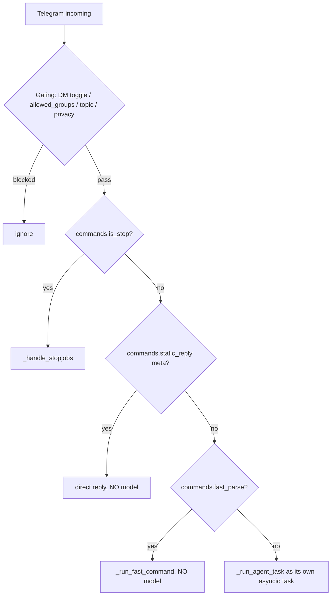

# The Bot Front-End

> WatcherDog's read-only-by-default Telegram talking bot — a separate Telethon bot client that routes human messages through three command layers, drives panels via the user account behind signed buttons, and resumes action tasks after a restart.

Part of [[Home]].

`bot_interface.BotInterface` (`watcherdog/bot_interface.py`) is the human-facing half of WatcherDog. It logs in as a **separate** Telethon BOT client (`start()` -> `sign_in(bot_token=...)`) on the SAME event loop as the user-account watcher described in [[The Monitor Loop]], embodying the [[Two Identities One Process]] split. A Bot API client cannot read another bot, so EVERY read and EVERY panel action it performs is delegated to the injected `user_client` — it reads and acts through the user account, never as itself.

> [!info] Why two clients share one loop
> The bot answers humans (only a bot can show a BotFather command menu and inline buttons), but only the user account can read the SinFermera farm bots. `BotInterface` is handed the watcher's `user_client` and its shared `state` (the `agent_lock`, the prompts, the `post_card`/`notifier` hooks). See [[Two Identities One Process]].

## Read-only by default

The agent runs read-only by default. A non-authorized turn uses `_DM_PREAMBLE` / `_GROUP_PREAMBLE` (untrusted, never-act, never-leak) plus `base_prompt` with `execute=False`. Authorized users get `_MULTIBOT_NOTE + action_prompt`; admins additionally get `_ADMIN_NOTE`; `_PROGRESS_NOTE` is prepended to every turn.

Capabilities are recomputed **live each turn** in `_capabilities(sender_id)`, which re-reads `bot_access.granted_ids(...)` and merges the static `action_user_ids` / `admin_user_ids`. A sender can ACT only if `bot_actions_enabled` AND they are a static action user, a live-granted user, or an admin.

> [!warning] Execute = capability AND delivery
> A turn only acts when `_capabilities` returns `can_act` AND `self.deliver` — i.e. `execute = can_act and self.deliver`. Because capabilities are recomputed every turn from a live `bot_access` re-read, grants and revokes (see [[The Learned-Fixes Brain]]'s sibling access list in [[Configuration]]) take effect immediately with no restart.

## Routing in `_on_message`

`start()` registers two handlers: `_on_message` (NewMessage incoming) and `_on_callback` (CallbackQuery). Routing is strictly ordered and short-circuits before any LLM:

1. **Gating** — DMs only if `bot_answer_dms`, groups only if `chat_id in allowed_groups`, and if `_group_topic` is set the message's `_message_topic_id(event)` must equal it (topic confinement). In groups only commands / @mentions / replies are acted on.
2. `commands.is_stop(text)` -> `_handle_stopjobs`.
3. `commands.static_reply` for meta (`/start`, `/help`, `/commands`, `/job`, `/jobs`) answered directly with NO model.
4. `commands.fast_parse` -> `_run_fast_command` (deterministic, NO model).
5. Everything else spawns `_run_agent_task` as its own `asyncio.create_task`.

Fast and agent turns are tracked in `self._inflight` for cancellation. The full command surface is documented in [[Commands]].

When `DISABLE_AI=true`, `_run_agent_task` does not call `agent.answer`, does not persist a resumable action task, and replies with the deterministic no-AI fallback. Direct/meta/fast commands still work because they are handled before this path.

> [!tip] Topic confinement is two-sided
> `_message_topic_id` filters INCOMING (wrong-topic messages are ignored) and `_group_reply_to` pins OUTGOING into `_group_topic`. `_group_topic` is parsed from `cfg.bot_topic` and is `None` (no restriction) unless the value is an int-looking string.

> [!warning] No BOT_TOPIC fallback to topic 7 in this module
> Docs imply `BOT_TOPIC` defaults to the hourly-report topic id 7. In `bot_interface.py`, `_group_topic` comes straight from `cfg.bot_topic` with NO fallback — it is `None` (unrestricted) when `BOT_TOPIC` is blank. Any `=7` default lives in [[Configuration]], not this module.

## Running one agent turn — `_run_agent_task`

`_run_agent_task` first checks `DISABLE_AI`; in model-free mode it sends the no-AI fallback and stops. Otherwise it picks the read-only vs action vs admin prompt, persists the task to the store **only when `can_act`** (read-only Q&A is never persisted), posts a live status message edited via `_progress`, calls `agent.answer(execute, can_grant, can_edit, on_progress=_progress, action_lock=state["agent_lock"])`, then swaps in the final answer and appends `[100% ✅]`. Reads and actions are performed by the injected `user_client`, never the bot. See [[The Agent]] for the tool-calling loop.

> [!warning] The status header is not "🔧 On it"
> The live status header is `<friendly_title>\n💭 thinking…` (or `♻️ Resuming — <title>` on a resume), NOT "🔧 On it — <task>". The "🔧 On it…" wording is what `_on_callback` shows on a button tap (`event.answer "On it…"`), not the agent-turn header.

## Concurrency and the lazy action lock

Each turn runs concurrently, capped by `self._sem = asyncio.Semaphore(bot_max_concurrent)`. `agent.answer` receives `action_lock=state["agent_lock"]` but acquires it **lazily** — only the moment it first presses a panel button — so read-only turns (status, reports, questions) never queue; only real panel-driving serializes.

> [!warning] Where the lock is actually grabbed
> The lazy `state["agent_lock"]` is acquired INSIDE `agent.answer` on first panel press, NOT in `_run_agent_task`. `_run_card_steps` (button taps) DOES hold the same lock around its presses. Read-only turns never serialize. This is the same lock the monitor incident handler, ibo listener, and Special Forces listener share — see [[The Monitor Loop]].

A concurrent-turn history merge in `_run_agent_task` relies on a synchronous get+set (no `await` between) so concurrent turns don't clobber each other's history.

## Task persistence and restart resume

`task_store.py` is atomic-write JSON (temp file + `os.replace`) under a `threading.Lock`, keeping the last 20 progress lines. `resume_active_tasks()` (called at startup) re-runs still-`in_progress` tasks, bumping `resume_count` and giving up past `bot_task_max_resumes`; a resumed turn gets a special "you were interrupted by a restart, re-check current state" recap prompt. This ties into [[Safe Self-Restart]].

> [!warning] Only action tasks resume
> Only `can_act` turns are persisted (read-only Q&A is not), so only action tasks resume after restart. `/stopjobs` and `/job` differ: `/job(s)` is a meta `static_reply` (no model) listing `task_store.active`; `/stopjobs` cancels in-flight asyncio tasks AND clears the store, and is gated to action-authorized users. `_handle_stopjobs` skips `asyncio.current_task()` so it never cancels itself.

## Alerts via the bot

`notify_owner` DMs the alert owner via the bot and returns `False` (never raises) so the monitor can fall back to the user account. A bot can only DM a user who pressed **Start**. The bot DM is the *preferred* alert channel — see [[Alerts and Heartbeat]]. `build_bot_commands` / `set_my_commands` build the BotFather menu from `MENU + FAST_MENU` (+ start/job/stopjobs/help) and install it via a pure-stdlib `urllib` POST to `setMyCommands`.

## Dependencies and state

The five front-end files (`bot_interface.py`, `commands.py`, `fast_commands.py`, `buttons.py`, `task_store.py`) import NO unpinned third-party libs — only `telethon>=1.36` plus Python stdlib (`urllib.request`, `hashlib`/`hmac`, `json`, `asyncio`, `threading`). State files (all created at runtime — there is no `data/` dir on a fresh checkout) are detailed in [[Data and State]]:

| File | Config key | Purpose |
|------|-----------|---------|
| `data/bot_tasks.json` | `BOT_TASK_PATH` | in-progress action tasks for resume (atomic temp+os.replace) |
| `data/bot_access.json` | `BOT_ACCESS_PATH` | runtime access grants, re-read live each turn |
| `data/daily_errors.jsonl` | `DAILY_ERRORS_PATH` | auto-fix / card-action log, read by `/fixes` |
| bot session file | `BOT_SESSION` | Telethon bot login session |

## See also

- [[Commands]] — the three command layers this front-end routes to
- [[Confirm and Action Buttons]] — the signed inline-button card model
- [[The Agent]] — the tool-calling loop `_run_agent_task` invokes
- [[Two Identities One Process]] — why the bot delegates reads/acts to the user account
- [[Alerts and Heartbeat]] — the bot DM as the preferred alert channel
- [[Configuration]] — every `BOT_*` key that wires this module
