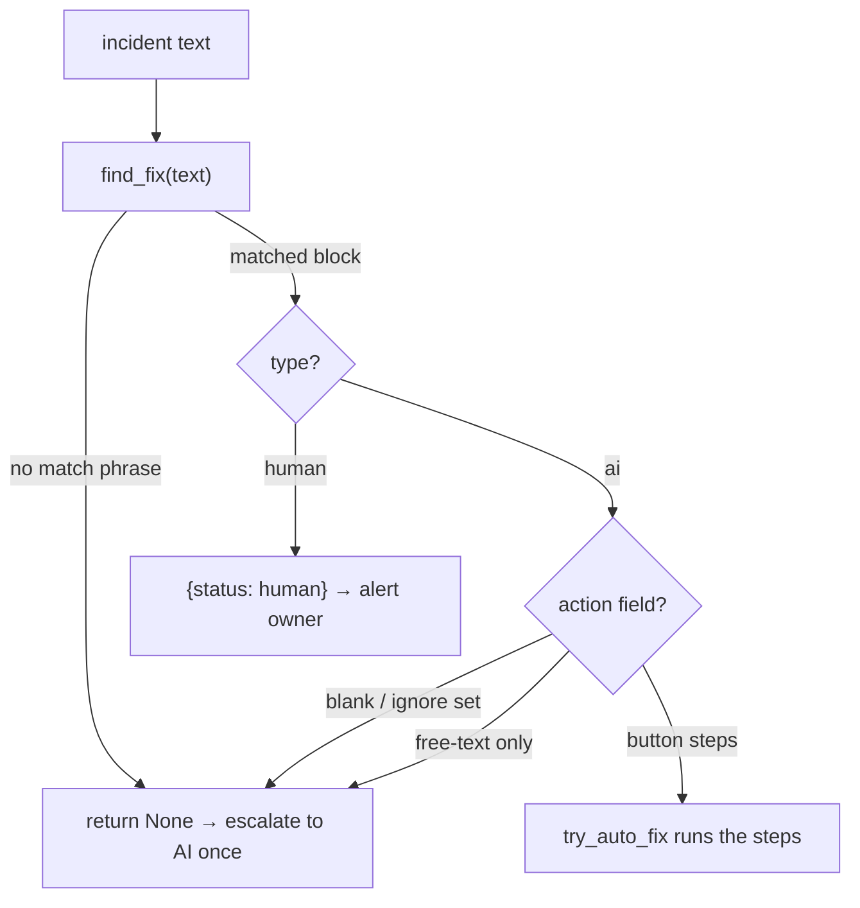

# The Learned-Fixes Brain

> A human-readable Markdown "brain" of error→fix mappings that the deterministic router consults FIRST, so a known error is handled with zero API tokens — the AI only writes new entries.

Part of [[Home]].

The brain is the memory half of [[Script-First AI-Last]]: a plain Markdown file (`data/hermes/learned_fixes.md`, created at runtime) that maps an error signature to a fix. `watcherdog/learned_fixes.py` parses it; [[Telegram Tools and Actions|auto_fix.try_auto_fix]] reads it on every above-threshold incident; [[The Agent]] appends to it whenever it solves something novel. Because the brain is text, a human can read, edit, or seed it by hand.

> [!info] Where it sits in the pipeline
> The brain is consulted by `try_auto_fix()` AFTER the local [[Telegram Tools and Actions|Ollama]] triage has already confirmed `is_error`/severity in the live monitor. See [[The Monitor Loop]] for the full ordering. The brain itself touches NO model — `find_fix` is pure substring matching.

## The Markdown format

Each fix is a `## heading` block (the heading becomes the `signature`) with recognized fields. `_FIELDS` is exactly:

| Field | Meaning |
|-------|---------|
| `match` | substring phrase matched (case-insensitive) against the message |
| `type` | `ai` (default) or `human` — `human` means "alert the owner, don't act" |
| `fix` | free-text human description of the fix |
| `action` | machine-executable button-label steps (the part the router can run) |
| `auto` | truthy (`{1,true,yes,y,on}`) to allow a destructive step to auto-run |
| `added` / `notes` | provenance metadata |

## Parsing rules (load_fixes)

`load_fixes(path)` (`watcherdog/learned_fixes.py:57`) parses `## heading` blocks into dicts, then:

- strips `<!-- ... -->` HTML comments via `_strip_comments` so template/seed examples in comments NEVER match,
- DROPS any block that lacks a `match` phrase (it can never fire),
- keeps only fields in `_FIELDS`.

> [!warning] A block with no `match` field is silently discarded
> `load_fixes` drops any block missing a `match` phrase. A hand-edited block that forgets `match:` will simply never fire — no error, no warning.

## Matching (find_fix)

`find_fix(text, *, path=None, fixes=None)` (`watcherdog/learned_fixes.py:93`) does **case-insensitive substring** matching of each block's `match` phrase against the message. Ties are broken by the **LONGEST match phrase** — the most specific block wins.

> [!warning] Tie-break is longest-phrase-wins, NOT file order
> If two blocks both match, the one with the longer `match` string is chosen. This is deliberate (most specific fix wins) but means file order is irrelevant — reordering blocks does nothing.

`is_human_fix(fix)` (`watcherdog/learned_fixes.py:113`) returns `True` only when `type == human`; `ai` is the default for any block that omits `type`.

## Writing new fixes (append_fix)

`append_fix(...)` (`watcherdog/learned_fixes.py:118`) appends a new block. It coerces `type` to `ai`/`human` and only emits `action`/`auto` lines when they are non-blank, so existing human-written blocks stay clean and readable.

> [!warning] `save_fix` is not a function in learned_fixes.py
> The agent tool the docs call `save_fix` is literally `learned_fixes.append_fix` — `agent.py:741` wraps it. There is no symbol named `save_fix` in `learned_fixes.py`. (README/DOCUMENTATION reference `agent.save_fix(...)`; that is the tool name, not the brain function.)

## How the router uses it (auto_fix)

`try_auto_fix()` in `watcherdog/auto_fix.py` re-runs [[Script-First AI-Last|classify()]] (returning `None` to escalate if the text is `normal`/blank), then calls `find_fix`. The full FIVE-status contract:

| `find_fix` result | Router status | Behavior |
|-------------------|---------------|----------|
| no mapping, or `action` blank/free-text only | `None` | escalate to [[The Agent|the agent]] once |
| `type: human` | `human` | alert owner, do not act ([[Alerts and Heartbeat]]) |
| `action` in `_IGNORE` `{ignore,none,noop,no-op,skip,suppress}` | `suppressed` | drop silently |
| destructive step + NOT `auto: yes` | `needs_confirm` | escalate / post a [[Confirm and Action Buttons|confirm card]] |
| runnable steps executed OK | `fixed` | press buttons, log via [[Scheduled Reports\|daily_report.record]] |
| a step returned error/`need_confirm` | `failed` | log `result="failed"`, escalate |

`parse_action` (`watcherdog/auto_fix.py:38`) splits the `action` field on `;`, `->`, `→`, or newline into ordered button-label steps. `is_ignore`/`_auto_ok` interpret `_IGNORE` and the `_AUTO_YES` set `{1,true,yes,y,on}`.

> [!warning] The status table in the prose docs omits `needs_confirm`
> README and DOCUMENTATION list only four outcomes (suppressed/fixed/failed/human). The code defines a FIFTH — `needs_confirm`, returned when steps contain a destructive label (`tg_actions.is_destructive`) and the block is NOT marked `auto: yes`. The `auto_fix.py` module docstring lists all five correctly.

> [!warning] `None` (escalate) fires in two non-obvious cases
> Beyond "no learned mapping at all", `try_auto_fix` also returns `None` when (a) a matched fix has a blank/free-text-only `action`, and (b) the message re-classifies as `normal`. Both fall through to the LLM once.

## The learning loop

The point of the brain is one-time learning: a novel error reaches [[The Agent]] (via [[The Monitor Loop|_incident_via_agent]]), the agent solves it, then calls `save_fix` (= `append_fix`) to write a runnable `action`. The NEXT identical error is handled router-only — zero tokens.

> [!warning] With AI off, the brain is read-only (human-seeded)
> The owner runs `DISABLE_AI=true`, so the agent never runs and never *writes* new blocks. The brain still **fires** — `find_fix` + the deterministic router are pure, model-free — but new entries must be seeded/edited **by hand**. The auto-learning loop above is the AI-enabled (reserved/optional) behaviour, not the default runtime. The routine panel watch/recover path doesn't use the brain at all; it runs on the deterministic [[Monitoring and Recovery Rules|R1–R6 engine]].

> [!tip] The brain is human-editable
> Because it is Markdown, you can pre-seed fixes by hand or correct the agent's entries. Just remember: every block needs a `match` phrase, and `action` steps must use the panel's exact button-label prefixes (see [[Telegram Tools and Actions]]).

> [!warning] No `data/` directory on a fresh checkout
> `data/hermes/learned_fixes.md` is created at runtime (`append_fix` `os.makedirs` the parent on first write). On a fresh clone the file — and the whole `data/` tree — does not exist yet. See [[Data and State]].

## See also

- [[Script-First AI-Last]] — the philosophy and full deterministic pipeline this brain anchors
- [[Telegram Tools and Actions]] — `auto_fix.try_auto_fix` router and `tg_actions.is_destructive`
- [[The Agent]] — solves novel errors and calls `save_fix` (= `append_fix`) to teach the brain
- [[Confirm and Action Buttons]] — what `needs_confirm` posts when a destructive fix is not auto-approved
- [[The Monitor Loop]] — where the router and brain are invoked per sweep
- [[Data and State]] — `learned_fixes.md` and `daily_errors.jsonl` runtime files
