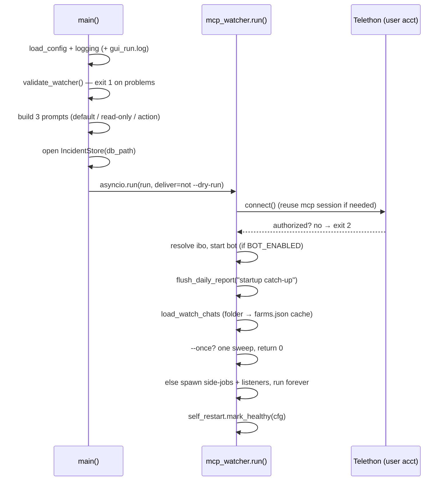

# Running WatcherDog

> The supported way to run WatcherDog: `run_watcher.py` with three flags, a `.env`, a one-time Telegram login, and an optional launchd service.

Part of [[Home]].

`run_watcher.py` is the single supported entry point. It boots config + logging + agent prompts and hands off to [[The Monitor Loop|mcp_watcher.run()]] — the one asyncio loop that connects as the owner's Telegram **user account**, sweeps the watch folder, answers ibo, and schedules side-jobs. Everything else (`run_gui.py`, `run.py`, `run_telegram.py`) is documented in [[Legacy Modes]].

> [!info] Two identities, one process
> `run_watcher.py` runs as the owner's user account (so it can read other bots' messages — the Bot API forbids that). The talking bot is a *separate* Telethon login started inside the same loop. See [[Two Identities One Process]].

## One-time setup

| Step | Command | Why |
|------|---------|-----|
| Authorize the user session | `tools/tg_login.py` | Phone → code → 2FA; saves the Telethon session file the watcher reads as. See [[Entry Points]]. |
| Find chat/folder ids | `tools/list_dialogs.py` | Lists groups/channels with ids to populate `WATCH_FOLDER` / `IBO_CHAT_ID`. |
| Configure | edit `.env` | ~94 keys; only three are required for the watcher (below). See [[Configuration]]. |

> [!tip] The watcher can run without a separate login
> `_resolve_session_string` reuses the **telegram-mcp** session string when the watcher has no file session of its own — so a single MTProto login can serve both. See [[Two Identities One Process]].

## The minimum config

`main()` calls `cfg.validate_watcher()` and **exits 1** on any problem. Crucially, `validate_watcher()` requires ONLY:

| Key | Purpose |
|-----|---------|
| `TELEGRAM_API_ID` | MTProto app id |
| `TELEGRAM_API_HASH` | MTProto app hash |
| `IBO_CHAT_ID` | the owner's chat the agent answers |

> [!warning] The bot token is NOT required to run the watcher
> Unlike `validate()` / `validate_mtproto()`, `validate_watcher()` deliberately does **not** require `TELEGRAM_BOT_TOKEN` or a chat id — the watcher sends as the user account. The bot front-end is optional (`BOT_ENABLED`). See [[Configuration]] for the full validator table.

If no `AGENT_API_KEY` / `OPENROUTER_API_KEY` is found, the watcher **warns but continues** (unless `--once`); the agent simply can't answer novel questions. Keys resolve `AGENT_API_KEY` → `OPENROUTER_API_KEY` env → `~/.hermes/.env`.

## The three flags

```
.venv/bin/python run_watcher.py            # run continuously (default)
.venv/bin/python run_watcher.py --once     # one monitor sweep, then exit 0
.venv/bin/python run_watcher.py --verbose  # DEBUG logging, run continuously
.venv/bin/python run_watcher.py --dry-run  # detect + log but NEVER send/act
```

| Flag | Effect |
|------|--------|
| `--once` | Exactly one `monitor_once` sweep, return 0. Does **not** start the bot, listeners, or any scheduled task. |
| `--verbose` | `logging.DEBUG` instead of `INFO`. |
| `--dry-run` | `deliver=False` everywhere: no messages sent, the [[The Learned-Fixes Brain|deterministic auto-fix router]] never presses real buttons, the agent runs `execute=False`. The startup banner's `ACTIONS:` line resolves to READ-ONLY / DRY-RUN / LIVE. |

> [!warning] `--once` is a probe, not a service
> `--once` skips the bot, the ibo/Special-Forces listeners, and every scheduled job (hourly/weekly/daily/recurring). Use it to smoke-test connectivity and one sweep — not to "run it briefly".

## What boot looks like



`main()` builds three system prompts via `_load_system_prompt` (loading `docs/hermes/` guides — see [[Hermes Skills]]): the default follows `AGENT_ACTIONS_ENABLED`, `bot_system_prompt` is forced read-only, `bot_action_prompt` is forced action-capable. It then opens [[Data and State|IncidentStore]] and runs the loop, closing the store in `finally`.

> [!warning] Exit codes
> `1` = config validation failed. `2` = Telethon not authorized (run `tools/tg_login.py`). `0` = clean (`--once` sweep, or graceful shutdown).

## Logs and the health beacon

Logging goes to **both** stderr and `cfg.gui_run_log` (`data/gui_run.log`); the log directory is created at runtime. On a successful boot, `self_restart.mark_healthy(cfg)` writes a pid+timestamp health beacon that the [[Safe Self-Restart|restart supervisor]] watches via mtime to confirm a relaunch came up OK.

> [!warning] Fresh checkout has no `data/` directory
> Every `data/*` path (`watcherdog.db`, `farms.json`, `gui_run.log`, the AI-fix log, etc.) is created on first write at runtime. See [[Data and State]].

## Running as a service (launchd, macOS)

`com.watcherdog.telegram.plist` runs `run_watcher.py --verbose` under launchd with `KeepAlive`/`RunAtLoad`:

```
cp com.watcherdog.telegram.plist ~/Library/LaunchAgents/
launchctl load  ~/Library/LaunchAgents/com.watcherdog.telegram.plist
launchctl unload ~/Library/LaunchAgents/com.watcherdog.telegram.plist   # stop
```

stdout/stderr append to `data/telegram.out.log` / `data/telegram.err.log`.

> [!warning] Disable self-restart under launchd
> The plist hardcodes `/Users/macmini4/Documents/WatcherDogBot` paths and (despite the `…telegram.plist` basename) targets `run_watcher.py`, not legacy `run_telegram.py`. Because [[Safe Self-Restart]] relaunches via `sys.argv`+`sys.executable`, leaving `BOT_SELF_RESTART_ENABLED` on under launchd would **double-launch** the process — disable self-restart in a launchd deployment.

For when boot/runtime goes wrong, see [[Troubleshooting]].

## See also
- [[The Monitor Loop]] — what `mcp_watcher.run()` actually does once boot hands off
- [[Configuration]] — the full key list and the three validators
- [[Entry Points]] — `run_watcher.py` vs the login/probe tools
- [[Troubleshooting]] — exit codes, missing keys, silent alerts
- [[Safe Self-Restart]] — the health beacon and why launchd disables it
- [[Legacy Modes]] — the three retired entry points
