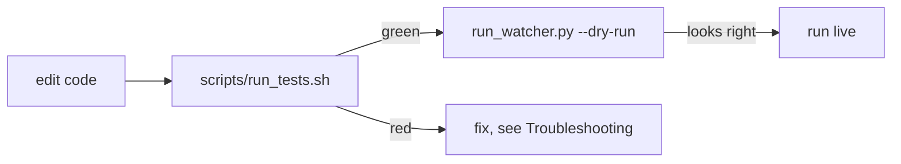

# Testing

> The pytest suite — **700+ test functions across 40+ `test_*.py` files** and growing; run `.venv/bin/python -m pytest` for the exact current numbers — and how to run it after any change.

Part of [[Home]].

WatcherDog ships a regression suite under `tests/`. Run it after every change to [[The Monitor Loop|the loop]], [[The Agent|the agent]], or any module — see the build/test rule in [[Running WatcherDog]].

> [!info] Counts drift — verify, don't trust
> The suite grows constantly (it has passed through 302 → 466 → 615+ `def test_` functions); don't hard-code a number in prose — run `.venv/bin/python -m pytest` for the live count. Recent additions include the allow-list/multi-user path (`test_multi_user`), the [[Monitoring and Recovery Rules|deterministic panel engine]] (`test_farm_stats`, `test_panel_rules`, `test_panel_actions`, `test_evaluate_panel`), and core coverage for the loop/bot/Telethon layers (`test_mcp_watcher_core`, `test_bot_interface_core`, `test_telegram_source`, `test_tg_tools_async`, `test_restart_helper`).

> [!warning] 4 PRE-EXISTING failures in a clean checkout (not regressions)
> A full `pytest` run reports **4 pre-existing failures** against an otherwise-green suite. All 4 are unrelated to logic:
> - **2 legacy GUI imports** need the unpinned `pyobjc`/`Quartz`: `test_smoke.py::test_module_imports[watcherdog.gui_mac]` and `[run_gui]` ([[Legacy Modes]]). Off macOS, or without pyobjc, they `ModuleNotFoundError: No module named 'Quartz'`.
> - **2 concurrency-timing assertions** in `test_bot_interface.py`: `test_action_turns_serialize` and `test_stopjobs_cancels_running_jobs_and_clears_store` — they fail in isolation on pristine code too.

## Running the suite

```
scripts/run_tests.sh                # run everything
scripts/run_tests.sh -k config      # only tests matching "config"
.venv/bin/python -m pytest          # direct
.venv/bin/python -m pytest tests/test_auto_fix.py   # one module
```

`scripts/run_tests.sh` `cd`s to the project root, prefers `.venv/bin/python` (falls back to `python3`), auto-installs `requirements-dev.txt` if `pytest` is missing, then `exec`s `pytest` passing through any args.

> [!tip] The dev dependency is just pytest
> `requirements-dev.txt` adds only `pytest>=8.0` on top of `requirements.txt` (which pins `telethon>=1.36` and `Pillow>=10.0`). The whole suite runs without Ollama, OpenRouter, or a live Telegram — it stubs those boundaries.

> [!info] Python 3.11–3.14 (venv = 3.14.3 + Telethon 1.43.2)
> Entrypoints use `asyncio.run()` and coroutines use `asyncio.get_running_loop()` (not `get_event_loop()`), so the suite passes on 3.11 through 3.14. The local venv is **Python 3.14.3 with Telethon 1.43.2**, and the MTProto handshake is verified working there. See [[Troubleshooting]].

## The 41 test modules

> [!tip] ⭐ marks modules added since the 302-test baseline. Counts are `def test_` functions per file (parametrization expands several into more cases at run time).

| Module | tests | Covers |
|--------|------:|--------|
| ⭐ `test_mcp_watcher_core.py` | 35 | [[The Monitor Loop]] — sweep, evaluate, send/alert, silence flags |
| ⭐ `test_bot_interface_core.py` | 34 | [[The Bot Front-End]] — routing, concurrency, callbacks (core) |
| `test_commands.py` | 32 | [[Commands]] — fast/AI/meta layers, expand, static_reply |
| `test_drop_stats.py` | 29 | [[Drop-Stats Pipeline]] — iso_week, parse, buffer, schedule |
| `test_config.py` | 29 | [[Configuration]] — env parse, path resolve, validators, **the allow-list parser** (`test_ibo_chat_ids_*`) |
| `test_bot_access.py` | 26 | grant/revoke/granted_ids access list |
| `test_alerter.py` | 26 | [[Alerts and Heartbeat]] — formatting + send sinks + 429/5xx retry |
| ⭐ `test_hermes_bridge.py` | 23 | [[Legacy Modes\|hermes_bridge]] — layout math, ask_hermes failure modes |
| `test_tg_actions.py` | 21 | [[Telegram Tools and Actions]] — press_button exact/prefix, is_destructive |
| ⭐ `test_tg_tools.py` | 20 | [[Telegram Tools and Actions]] — filter_title, entity_name, _chat_ref, latest_message error-swallow |
| `test_storage.py` | 19 | [[Data and State\|IncidentStore]] — dedupe + recurring order |
| `test_monitor.py` | 19 | [[Legacy Modes\|LogMonitor]] + error_hash/normalize_error, logrotate |
| `test_daily_report.py` | 18 | [[Scheduled Reports]] — jsonl log, hourly/daily summaries |
| `test_bot_interface.py` | 18 | [[The Bot Front-End]] — routing, capabilities, callbacks (2 concurrency tests fail pre-existing) |
| ⭐ `test_tg_tools_async.py` | 17 | [[Telegram Tools and Actions]] — async read helpers against a stub client |
| ⭐ `test_multi_user.py` | 17 | the **allow-list** path — `resolve_ibos`, reply-to-sender, fan-out `_send`/`_alert` to all |
| `test_auto_fix.py` | 17 | [[Script-First AI-Last]] — the deterministic router |
| `test_roster.py` | 16 | [[Roster and Health Scan]] — scan + classify_status |
| `test_analyzer.py` | 15 | [[Script-First AI-Last\|Ollama analyzer]] (+ _fallback, truncation) |
| ⭐ `test_restart_helper.py` | 14 | [[Safe Self-Restart]] — the detached Layer-2 supervisor |
| `test_learned_fixes.py` | 14 | [[The Learned-Fixes Brain]] — parse, find_fix, append_fix |
| `test_heartbeat.py` | 14 | [[Alerts and Heartbeat\|HeartbeatMonitor]] (legacy path) |
| ⭐ `test_panel_rules.py` | 13 | [[Monitoring and Recovery Rules]] — the R1–R6 `decide`/`observe` engine |
| ⭐ `test_telegram_source.py` | 12 | [[Legacy Modes\|telegram_source]] — make_client, resolve_chat_ids, handler |
| `test_buttons.py` | 12 | [[Confirm and Action Buttons]] — signed token model |
| `test_fast_commands.py` | 11 | fast command handlers |
| ⭐ `test_evaluate_panel.py` | 11 | [[Monitoring and Recovery Rules]] — `mcp_watcher._evaluate_panel` glue + R4 follow-up |
| `test_classifier.py` | 10 | [[Script-First AI-Last\|classify()]] error/normal/unknown |
| ⭐ `test_bot_logging.py` | 9 | [[Legacy Modes\|bot_logging]] — install(), excepthook wiring |
| `test_agent_dispatch.py` | 9 | [[The Agent]] — fan-out / dispatch |
| `test_self_restart.py` | 8 | [[Safe Self-Restart]] — pre-flight + rollback |
| `test_mcp_report.py` | 7 | [[The Monitor Loop]] reporting helpers |
| `test_fanout.py` | 7 | sub-agent fan-out concurrency |
| ⭐ `test_panel_actions.py` | 5 | [[Monitoring and Recovery Rules]] — named panel actions over press_button |
| ⭐ `test_farm_stats.py` | 5 | [[Panel Control Bot]] — `parse_panel_status` / `launched_from_alert` |
| `test_task_store.py` | 5 | [[The Bot Front-End\|task_store]] persistence/resume |
| `test_run.py` | 4 | [[Legacy Modes\|run.py]] log-mode pipeline |
| `test_hourly_report.py` | 4 | [[Scheduled Reports\|hourly report]] guard |
| `test_card_routing.py` | 4 | [[Confirm and Action Buttons\|card]] routing |
| `test_agent_progress.py` | 4 | live progress bars |
| `test_smoke.py` | 2 | import + boot smoke test (2 GUI imports fail w/o `pyobjc`) |

> [!info] `conftest.py` is the 42nd file
> `tests/` holds 41 `test_*.py` modules plus `conftest.py` (the 42nd `.py` file, which just puts the project root on `sys.path`). `tests/README.md` is documentation, not code.

## What the tests exercise

The suite is unit-heavy and dependency-light by design — most modules are pure stdlib or stub the network:

- **Token-free stages** ([[Script-First AI-Last]]): `classify()` and `find_fix()` touch no model, so `test_classifier`/`test_learned_fixes` run fully offline.
- **Telethon-free button model** ([[Confirm and Action Buttons]]): `ActionRegistry` is deliberately Telethon-free, so `test_buttons`/`test_card_routing` verify HMAC signing, single-use consume, and ttl expiry without a client.
- **Atomic JSON stores**: `task_store` and `bot_access` use temp-file + `os.replace`, tested for concurrent-safe writes.

> [!tip] Two helpers for manual / integration testing
> Beyond pytest, `tools/demo_learned_fix.py` demos the learn-once-then-auto behavior (temp brain, `execute=False`) and `tools/simulate_error.py` writes a fake traceback/ERROR line into `logs/<bot>.log` to exercise the legacy `run.py` detect→analyze→alert pipeline. See [[Entry Points]] and [[Legacy Modes]].

## Verifying a change



After code changes: run the suite, then a `--dry-run` sweep ([[Running WatcherDog]]) before going live. For failures, see [[Troubleshooting]].

## See also
- [[Running WatcherDog]] — the `--dry-run` step that pairs with the suite
- [[Troubleshooting]] — diagnosing failures the tests surface
- [[Script-First AI-Last]] — the token-free stages with the heaviest coverage
- [[Module Reference]] — the modules each test file maps to
- [[Entry Points]] — `tools/` probes used for manual testing
- [[Home]] — knowledge-base index
