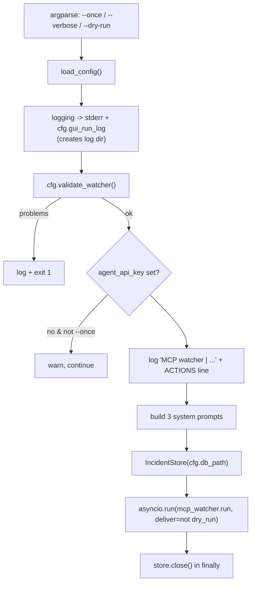

# Entry Points

> `run_watcher.py` is the one supported launcher: it parses three flags, loads config, builds three agent prompts, opens the incident store, and hands off to the monitor loop — everything else (`run.py`, `run_telegram.py`, `run_gui.py`) is legacy.

Part of [[Home]].

WatcherDog has one supported entry point and three retired ones. This note is the map of how a process is born; the loop it boots is [[The Monitor Loop]] and the philosophy it serves is [[Script-First AI-Last]].

## The supported launcher: `run_watcher.py`

`main()` (`run_watcher.py:102`) is the front door.

### Flags

| Flag | Effect |
|------|--------|
| `--once` | one `monitor_once` sweep, returns 0; NO bot, listeners, or scheduled tasks |
| `--verbose` | verbose logging |
| `--dry-run` | `deliver=False` — never presses real buttons, never sends; falls through to alert/agent logic |

The `ACTIONS:` log line resolves to one of **READ-ONLY / DRY-RUN / LIVE**.

> [!warning] `--dry-run` disables the deterministic [[Script-First AI-Last|auto-fix router]] entirely (it is gated on `agent_actions_enabled and deliver`). `--once` does a single sweep WITHOUT the bot or any schedule. See [[Running WatcherDog]].

### Validation

`main()` runs `cfg.validate_watcher()` and bails with exit code 1 on config problems. It warns (but continues) if no `agent_api_key` is set, unless `--once`.

> [!info] `validate_watcher()` requires ONLY `telegram_api_id`, `telegram_api_hash`, and `ibo_chat_id` — deliberately NOT the bot token, because the watcher sends as the user account ([[Two Identities One Process]]). The stricter `validate()` and `validate_mtproto()` are used by legacy entry points. See [[Configuration]].

### The three prompts

`main()` builds three agent system prompts via `_load_system_prompt` (`run_watcher.py:74`), each a preamble (`_PREAMBLE_READONLY` or `_PREAMBLE_ACTIONS`) plus markdown guides from `docs/hermes/` ([[Hermes Skills]]):

| Prompt | Capability |
|--------|-----------|
| default (`system_prompt`) | follows `AGENT_ACTIONS_ENABLED` |
| `bot_system_prompt` | forced read-only |
| `bot_action_prompt` | forced action-capable |

These feed [[The Agent]] for ibo, the bot, and Special Forces respectively.

## Login tooling

Before `run_watcher.py` can connect, the user account needs a session (or it reuses the telegram-mcp session string). The helpers live in `tools/`:

| Script | Purpose |
|--------|---------|
| `tools/tg_login.py` | one-time interactive Telethon login (phone → code → 2FA); saves the session file |
| `tools/list_dialogs.py` | lists groups/channels with ids to populate `WATCH_CHATS` |
| `tools/agent_probe.py` | runs the current `agent.answer()` path and prints (or `--send`) the reply |
| `tools/simulate_error.py` | writes a fake traceback / ERROR line for the legacy `run.py` pipeline |
| `tools/demo_learned_fix.py` | demos [[The Learned-Fixes Brain]] (ask once, auto-apply on repeat) |

## Legacy entry points

These predate `run_watcher.py` and are kept for reference only — full detail in [[Legacy Modes]].

| Launcher | Mode | Reads via |
|----------|------|-----------|
| `run.py` | log-file tailer (`monitor.py`) | filesystem `*.log`, zero PyPI deps |
| `run_telegram.py` | MTProto group reader (`telegram_source.py`) | Telethon user account |
| `run_gui.py` | macOS GUI/OCR (`gui_mac.py`) | screenshots + Apple Vision OCR, no Telegram API |

> [!warning] The legacy modes are NOT the supported path. They use the `alerter.TelegramAlerter`/`UserClientAlerter` sinks and the `HeartbeatMonitor`, neither of which the supported `run_watcher.py` path uses (it has its own inline silence detection and bot-DM-first `_send`/`_alert`). See [[Alerts and Heartbeat]].

> [!warning] Self-restart caveat: the relaunch is a same-launch via `sys.argv` + `sys.executable`. Under launchd this double-launches, so [[Safe Self-Restart|self-restart]] should be disabled in a launchd-managed deployment.

## State opened at startup

`main()` opens `IncidentStore(cfg.db_path)` (closed in `finally`) and configures logging to both stderr and `cfg.gui_run_log` (creating the dir at runtime). There is no `data/` directory in a fresh checkout — every state file is created on first use. See [[Data and State]].

## See also
- [[The Monitor Loop]] — what `main()` hands off to.
- [[Configuration]] — the keys `validate_watcher()` checks and the three flags map to.
- [[Running WatcherDog]] — operator-facing run instructions.
- [[Legacy Modes]] — the three retired launchers in depth.
- [[The Agent]] — consumer of the three built prompts.
- [[Home]] — the vault index.
